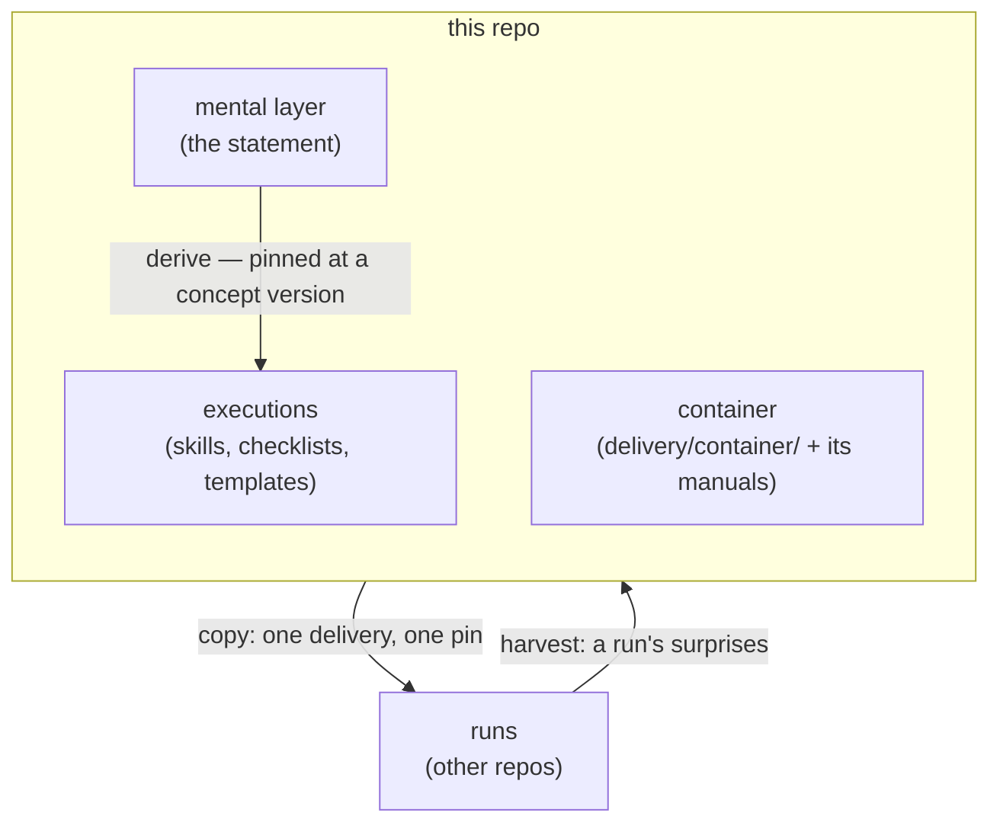

# Architecture

<!-- Describes the system AS IT IS NOW — not the aspiration. 1–2 pages max.
     Update trigger: a plan step's gate closes and this no longer matches
     reality. For the WHY behind any shape, link the ADR. -->

## Overview

A documentation system, not code: one concept repo on the concepts
tier of the workspace (concepts → runs, the tier above empty — see
docs/models/tiers.md, this repo's since ADR-0026). It holds two
layers: the **mental layer** — the plain-words statement of
correctness by construction, its rationale, open questions, and the
log of what changed it — and the **executions** derived from it
(agent skills, checklists, templates), each pinned to the concept
version it derives from. It also holds the **container** a run is
born into — this repo's own (ADR-0024, ADR-0025, ADR-0038) — so a
run has one upstream and one pin. Delivery flows down as pinned copies
into run repos; learning flows back up as harvested concept changes,
after which executions are re-derived.

What it ships is three groups, and each is a directory under
`delivery/` (ADR-0029): **`container/`**, **`method/`** and
**`spring-postgres/`**. A skill belongs to exactly one and travels
whole; a group is copied whole or not at all. A project on another
stack takes two of the three, decided by reading their names.

## Components

### Mental layer (`concept/`)

Responsibility: the authoritative plain-words statement of the
concept — five chapters, read `00-cbc.md` first. The only place the
concept's substance changes; a state of this directory is what a
concept version names.
Why shaped this way: ADR-0003 (versioning); several documents because
the statement's own split is by chapter (Framing, Step 2).

### Executions (`delivery/method/`, `delivery/spring-postgres/`, `delivery/fills/`)

Responsibility: the derived layer a run repo receives at birth,
covering the whole pipeline (cbc-framing → infra-establish /
infra-serve → cbc-bootstrap → cbc-slice), each skill's `foundation`
field naming the concept version it derives from or is checked
against (ADR-0005, ADR-0036).
Two kinds by how they land (ADR-0017), which is a different
question from which group they are in: `method/` and
`spring-postgres/` hold the five skills with their references,
each group laid out as the piece of the run's tree it lands as
(`<group>/.claude/skills/<name>/`, ADR-0036), copied as files the
run keeps pinned — cbc-framing and cbc-slice
ship the same
`references/worked-example.md`, one document read in halves, Part 1
the framing and Part 2 the slice, duplicated so either skill's
directory stands alone; the two copies are byte-identical and a
change to one lands in both, which `diff` checks now that neither
carries a header (ADR-0022); `fills/` holds text the seed writes
into the container's own files and the run then owns. One member
since ADR-0024: the pure playbook's steps into PLAN (cbc-run-pure,
ADR-0016). The two entry-file fills retired there — their bodies
ship inside the container itself, which is the same
whole-file-never-merged rule at a new address (ADR-0015,
ADR-0019).
Content, not this repo's working arrangement: nothing here is
installed in this repo's own `.claude/`, and the archive's agent
definitions stayed behind (ADR-0006). Two skills carry copy-and-fill
template masters in `templates/` beside their references, extracted
from the first run's lived files; a run fills them and the filled
file is the run's own (ADR-0008).
The groups cut between skills, never through one (ADR-0029):
`method/` holds cbc-framing and cbc-slice, the two that derive from
concept v1 and carry no stack at all; `spring-postgres/` holds
infra-establish, infra-serve and cbc-bootstrap, whole. A project on
another stack therefore gets no ground or bootstrap skill —
not the walkthroughs and not their stack-free stages either. All
three are practice-born (ADR-0005), and another stack's versions
are that stack's to harvest, landing as a fourth group beside this
one. The pipeline this repo describes is whole only for this
stack.
The stay-home delivery docs sit beside the bundle, outside the copy
set (ADR-0010): the starter doc (`delivery/README.md`) states the
birth mapping and the authoritative-vs-pinned rule; the install manual
(`delivery/installs/pure-seed.md`) is the birth procedure
(ADR-0016) — the material-only seed, copying the container from
`delivery/container/` and the method beside it, its deliveries committed
on a receipt branch the newborn never merges (ADR-0018).
Why shaped this way: ADR-0004 (amended), ADR-0006, ADR-0008,
ADR-0010, ADR-0016, ADR-0017, ADR-0018, ADR-0019, ADR-0024,
ADR-0029.

### Container (`delivery/container/`, `docs/conventions/`)

Responsibility: what a run is born into — records, conventions,
hygiene, entry files — and this repo's to shape (ADR-0025). Where
it came from is ADR-0038's record, and nothing tracks that repo.
Two files were added that it did not begin with: one convention
(ADR-0031) and the shapes rule,
the container's first `.claude/rules/` artifact (ADR-0035, its
convention ADR-0037). Three more conventions were added and
discarded, 2026-09-24 — two unused, and `artifact-kinds` after five
firings in a year. The eight convention manuals sit in
`docs/conventions/` — the *why* behind each rule, for a maintainer,
never shipped — and move with the rules they explain. Inside the
container the parts divide by how they reach a run: the three
convention skills and the two rules travel again at an update; the
record stubs, the entry files and the hygiene files are the run's
own from birth and never travel twice. Eight conventions, three
skills and two rules — the other three reach a run through the
stubs and templates they ship as.
Why shaped this way: ADR-0025 (ours), ADR-0024 (the take that
brought it here), ADR-0038 (where it came from is history),
ADR-0031 (the first convention written here).

## Invariants

<!-- What must never happen here, and where each rule is actually
     held. This repo has no runtime: a rule is held by a header that
     travels with a file, a standing comment, a procedure, or a check
     at commit review - so each entry names which. -->
- Concept substance never changes in the archive — this repo is
  authoritative, the archive a historical snapshot (retired
  2026-08-28: frozen, never consulted as a source again; provenance
  pins remain checkable against it). Enforced in each chapter's
  provenance header, which travels with the file.
- A substantive concept change never lands without a version entry.
  Enforced in CHANGELOG's standing comment and ADR-0003; checked at
  commit review — a review-grade wall, named as such.
- An execution never lands without stating which concept version it
  derives from. Enforced in each skill's `foundation` field, which
  travels with every copy into a run repo (ADR-0004, ADR-0036).
- A manual never outlives the rule it explains: a rule changed in
  `delivery/container/` moves its manual in `docs/conventions/` in the
  same commit. Enforced in `docs/conventions/README.md` — a stale
  manual
  is the kind of lie nothing catches, because it is read rarely and
  by whoever is least sure (ADR-0025).
- A pin never claims more than was checked. Enforced where this
  repo still reads what it does not own, which is now the runs: a
  compare is a reading over two diffs and the verdict is written
  every time, including "taught nothing" (ADR-0023, narrowed by
  ADR-0025).
- A skill never spans two groups, and nothing unusable without
  Spring, PostgreSQL, Maven or podman sits under `method/`.
  Enforced by the shape as much as at commit review — a group is a
  directory, so a misfiled file is visible as a path (ADR-0029).
  The test for the group is what the *skill* assumes, not what a
  sentence mentions: a method file may name a lived default.
- A record stub is never re-delivered to a live run. Enforced in
  the run's own rule, `delivered-copies.md` rule 1, and the
  exchange's §5: the records are the run's own from birth, not
  copies, and no delivery touches them (ADR-0036).

## Codemap

<!-- Where to find things. Directory → what lives there. -->
| Path | What lives there |
|---|---|
| `concept/` | The mental layer: five chapters, `00-cbc.md` first (concept v1) |
| `delivery/` | The delivery layout (ADR-0010, ADR-0017, widened by ADR-0024): `container/` is what a run is born into, this repo's (ADR-0025; where it came from is ADR-0038's record) — named `kit/` until ADR-0029, which renamed it for what it is; `method/` and `spring-postgres/` are the two groups a run copies as pinned files — two skills and three, whole, a group taken entirely or not at all (ADR-0029), each laid out as the piece of the run's tree it lands as, so staging is copying the groups on top of one another and `concept/` → `docs/concept/` is the one mapping (ADR-0036); `fills/` is text written into the container's own files (the playbook's steps); `README.md` describes, maps, and says what the container holds; `installs/` holds `pure-seed.md` for birth (ADR-0016); every update after it is the exchange, `docs/conventions/exchange/`, whose two skills sit in this repo's `.claude/skills/` (ADR-0036); a shape rides the group of the thing it shapes, an exposed one as a pinned copy and an unexposed one staged at a gate, held apart from the groups and naming its own (ADR-0035) |
| `docs/baselines/` | Held baselines — artifacts withheld from delivery, blind to newborns, compared against lived results: the frozen playbook (ADR-0012) and the Spring slice reference, handed to no run at any moment and opened once at a run's Release step (ADR-0033, superseding ADR-0021's hand-off). **Trial evidence, and not shapes** (ADR-0035): what is withheld here is withheld *in order to stay* undelivered, because a derivation that has seen it measures imitation — where a shape is withheld only until a gate, after which being in front of the next writer is the point. The two look alike and their blindness runs opposite ways; a shape does not live here, and nothing here ships under a shape's rule. Which of these files is which is not yet sorted — its own change set |
| `docs/models/` | Two models, this repo's (ADR-0026; where they came from is ADR-0038's record). Neither is delivered. The shapes model that sat beside them became the shapes convention's manual (ADR-0037) |
| `docs/conventions/` | Eight convention manuals, this repo's — five that came with the container (ADR-0025, ADR-0038) and three written here: `visual-comparison` (ADR-0031), `exchange` (ADR-0036), `shapes` (ADR-0037, the model reshaped); its own `README.md` is the index and carries the container's rules, among them that a manual moves with its rule |
| `docs/adr/` | Architecture decision records |
| `devlog/` | Session-by-session work history |
| `temp/` | Working drafts, tracked and deleted when served — handoffs, replies, briefings being molded (not records; `temp/README.md` holds the rule) |
| `CHANGELOG.md` | The concept-version log (ADR-0003) |
| `.claude/` | Working arrangement: skills, agent decisions log |
