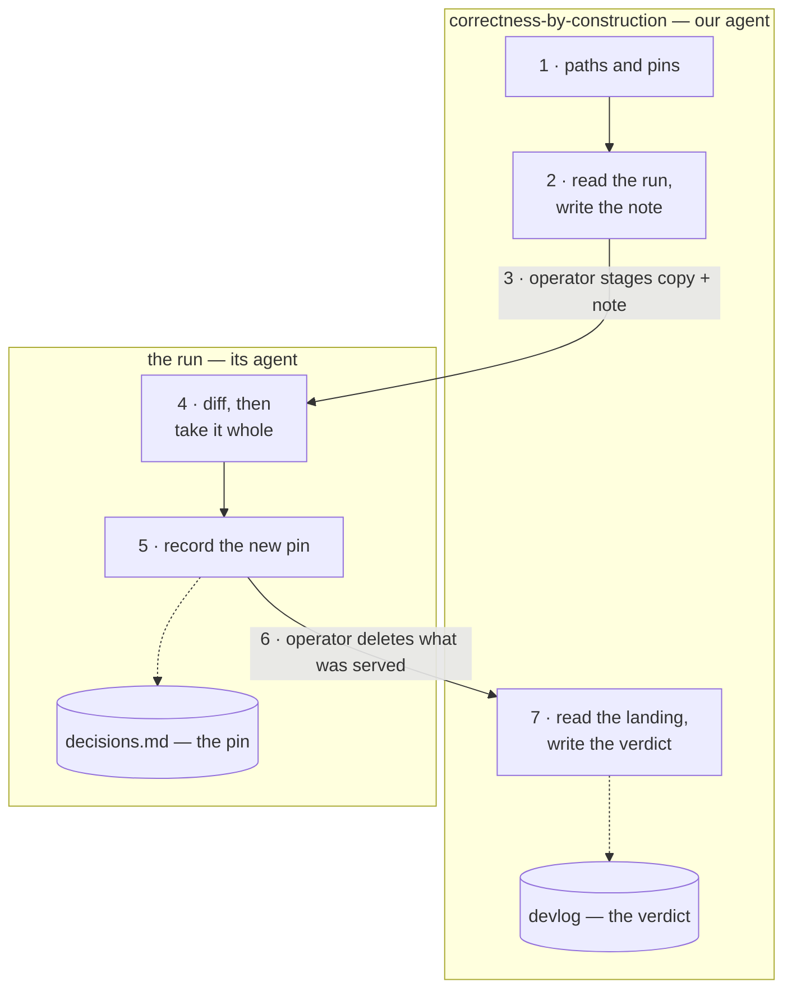

<!-- The bundle's update procedure, peer of pure-seed.md, which
     covers a run's birth and nothing after it. Authored 2026-09-17
     from the one lived case — run 3's re-pin to @ 7bbf49a on
     2026-09-15, which ran without a written procedure — and from
     ADR-0022, which decided what replaces the harvest lines the
     bundle's shipped files used to carry. Stays home: nothing in
     installs/ ships (ADR-0010). -->

# Install: the bundle update — a note and a copy

One idea: the run receives what changed and why, and decides for
itself. **What changed** is the files. **Why** is a note. Neither
substitutes for the other, and the run is handed no path to this
repo — what it needs to read is placed in its own `temp/`, so
there is nothing else within reach and nothing to forbid
(ADR-0022).

The run may have edited its copies since its pin. That is allowed,
under rules it keeps and logs, and it changes only one thing here:
the harvest reads a diff before the note is written.

Who does what: **this repo's agent** reads and writes the note;
**the operator** carries it and the files; **the run's agent**
evaluates, takes, and records. No agent reaches into another
repo's working tree.



The operator is not a box, because the operator is not a place:
steps 3 and 6 are the two crossings, and they are the only things
that cross. Each side writes one record, in its own log. The map is
an entry point — the steps below are the procedure, and each keeps
the reasoning it needs at the moment it is done (ADR-0028).

---

**1. Set the paths and capture the pins.**

```bash
run_dir=~/IdeaProjects/<run-name>
bundle_dir=~/PycharmProjects/engineering/concept-garden/correctness-by-construction

new_pin=$(git -C "$bundle_dir" rev-parse --short HEAD)
# the run's current pin: the hash in its last bundle entry
grep -n "bundle updated @\|the five CbC skills, pin @" "$run_dir/.claude/decisions.md" | tail -2
```

The old pin is the run's, written in its own log. This repo does
not hold it.

**2. Read the run, then write the note.** (this repo's agent)

Read-only, and scoped: what the change touches, plus the records
around it — the step it lands in, the decisions log, the TODO. Not
the whole repo.

**One exception to the scoping, learned 2026-09-18.** When the
change renames or renumbers anything the run may have cited — a
section, a file, a rule — grep its whole tree before writing, not
only the records you expect it in. A citation lives wherever
someone once needed it, and no diff can find it: the stale text is
in the run's own writing, not in the files it receives.

**And grep for every identifier the change moved, not only the one
you are describing.** Our note of that date named two stale `§8`
citations; never-oversold found four. The third was in its entry
file, which we did not think to read. The fourth was in its
decisions log and cited `§7` — the registry section, which moved to
§2 in the same renumbering. A search for `§8` could never have
found it, and neither could a reader who had only the change in
mind. A renumbering moves every number, so the search is for every
old number, and the cheapest form is the whole span: `§1` through
`§9` here.

**A changed *relationship* needs the same sweep, and no string
search will start it for you** (learned 2026-09-20, the third
undercount in three deliveries). The rules above are about
identifiers: something was renamed or renumbered, so there is an
old word to grep for. When what changes is a **party** — who the
run's upstream is, who owns a file, who is waiting for a report —
**nothing is renamed and no word changes**, so a grep for the
change finds nothing and the sweep never starts.

Grep for the *old party's name* instead, across the run's whole
tree, and read every hit rather than the ones you came for. Our
note of that date named two items pointing at the handbook;
never-oversold found three, and two more mentions in a file we had
not thought to open. Its own wording is the rule: **a map
correction moves every arrow that pointed at the old party, not
the two the sender has in mind.**

The sweep is wider than a rename's, because a party is named in
more kinds of sentence than an identifier is: an item *owed to*
them, a decision *provisional on* their answer, a procedure that
*diffs against* them, a record saying where a file *came from*. The
last of those usually stays true and the first three usually do
not, so read each hit for which kind it is rather than editing on
sight.

**A renamed convention needs one more thing, and the copy step will
not do it for you** (learned 2026-09-19, when `change-plans` became
`commit-plan`). Step 4 copies conventions by name, so a rename
*adds* the new directory and leaves the old one in the run — two
skills stating the same rules, one of them abandoned, and an agent
that loads whichever it finds first. The note must therefore say
**old name → new name** in its own line, and step 4 must delete the
old directory by name.

Three more things move with it, and none of them is reached by a
diff: the run's registry entry names the old convention at a hash;
any `requires:` line in another skill names it; and the convention's
artifact may be renamed too — ours took `CHANGE-PLAN.md` to
`COMMIT-PLAN.md`, which a run with one in flight has to move rather
than copy. Say all of it in the note; the run cannot infer any of it
from the files it receives.

If the run edited its copies, diff them against what it received,
using the run's own history, not ours:

```bash
git -C "$run_dir" diff <run's-delivery-commit> -- \
  .claude/skills/cbc-framing .claude/skills/cbc-bootstrap \
  .claude/skills/cbc-slice .claude/skills/infra-establish \
  .claude/skills/infra-serve docs/concept
```

The five and the concept chapters — the method half of what the
run holds from here. Named rather than globbed, as everywhere else
in this manual: a `cbc-*` pattern would also catch a skill of the
run's own.

**The container half updates by a different rule, and most of it
never updates at all.** Since ADR-0024 the run's container comes
from `delivery/container/` here, and its parts divide:

- **The seven convention *skills*** are pinned copies and travel
  at a kit re-pin, the same way the five method skills do; the
  run's own `convention-lifecycle` governs how it takes them. Eight
  conventions, five skills: `project-recording`, `repo-hygiene`
  and `agent-arrangement` ship through stubs and templates, which
  fall under the next rule and never travel again. Four of the
  five came from the handbook; one — `visual-comparison` — is this
  repo's own (CBC ADR-0031) and changes when we change it, so a
  re-pin is no longer the only reason this group moves.
- **The record stubs** — `PLAN.md`, `TODO.md`, `devlog/`,
  `ARCHITECTURE.md`, `CHANGELOG.md`, `.claude/decisions.md`, the
  first ADR — are the run's living records from its first session.
  They never travel again. Re-delivering one would overwrite the
  run's own work with a stub.
- **The two entry files and the hygiene files** are the run's own
  from birth on the same rule, the hygiene files having grown a
  stack overlay the moment the run bootstrapped.

So a kit re-pin delivers seven files, not sixteen, and the note
says which of the seven moved and what changed in them. Seven names
in two loops below is more to be wrong about than four, and the
list is now two things deep — which conventions exist, and which of
them ship as a skill. The standing item to derive this set from the
run's pin rather than a list is worth reading before an eighth
arrives.

**Which repo is the run's deliverer.** `convention-lifecycle` used
to send a project to *the handbook* for its compare, and a run born
under one chain holds no handbook checkout. Since 2026-09-20 both
§2 and §3 say **the deliverer** throughout — never-oversold
reported the §2 half, and the §3 half was found beside it — so the
question answers itself: we are the deliverer, and the payload in
the run's `temp/` is the checkout it compares against. The note
names the kit hash the container half is held at, which is the hash
that procedure compares from.

Empty means no local layer. Non-empty is the hand-off: each hunk is
taken, reshaped or declined, in our own wording, in the commits
that take it.

Then write the note into this repo's `temp/`. What it carries is
below.

**3. Stage the copy and the note in the run's `temp/`.** (operator)

```bash
staged="$run_dir/temp/bundle-$new_pin"
mkdir -p "$staged"/concept "$staged"/conventions

# the shipping groups — the skills and the concept chapters.
# Stage only the groups the run was born with: a run that took
# method/ alone must not be handed spring-postgres/ at an update
# (CBC ADR-0029). Its .claude/skills/ says which it holds.
for d in "$bundle_dir"/delivery/method/*/ \
         "$bundle_dir"/delivery/spring-postgres/*/; do
  [ -d "$run_dir/.claude/skills/$(basename "$d")" ] || continue
  cp -r "${d%/}" "$staged"/
done
cp "$bundle_dir"/concept/*.md "$staged"/concept/

# the container half — the five convention skills, and only those.
# The other three conventions ship as stubs and never travel again.
for c in commit-messages commit-plan artifact-kinds \
         convention-lifecycle visual-comparison; do
  cp -r "$bundle_dir"/delivery/container/.claude/skills/"$c" "$staged"/conventions/
done

cp "$bundle_dir"/temp/<the-note>.md "$run_dir/temp/"
```

Nothing is overwritten yet. The run sees what is coming before it
takes it.

**The container half is staged only when it moved**, and only these
four. The record stubs, the entry files and the hygiene files are
the run's own from birth and are never staged — a copy of one would
be an offer to overwrite the run's own work with a blank. A run
still taking its conventions from the handbook directly gets no
`conventions/` directory here, and the note says which case it is.

The concept chapters are staged every time, changed or not, so the
run compares rather than trusts a claim that they did not move.
They usually have not.

**4. The run evaluates and takes it whole.** (the run's agent)

It reads the note, reads its own records, and diffs the staged copy
against what it holds. Then it takes the whole thing:

```bash
for s in cbc-framing cbc-bootstrap cbc-slice infra-establish infra-serve; do
  rm -rf .claude/skills/$s && cp -r temp/bundle-<pin>/$s .claude/skills/
done
cp temp/bundle-<pin>/concept/*.md docs/concept/

# only if the container half was staged
for c in temp/bundle-<pin>/conventions/*/; do
  n=$(basename "$c"); rm -rf .claude/skills/$n && cp -r "$c" .claude/skills/
done

# a renamed convention: the loop above added the new name and left
# the old directory standing. The note names the pair; delete it.
rm -rf .claude/skills/<old-name>
```

Whole, never re-derived. A pin names an exact state, and a copy the
run reworded would make it lie (ADR-0022). A declined edit of the
run's own is gone with the overwrite and is never edited back; what
the run still needs goes into the run's own records.

A change-plan only if the landing is a sequence — a copy and a log
entry is two commits and needs none.

**5. The run records the new pin.** (the run's agent)

One entry in its `.claude/decisions.md`: the new hash, the old one,
what moved, what the note said about its own edits, and what it
decided. Where the container half moved too, the entry names both
hashes — ours for what was delivered, the handbook's for the state
inside it — because one hash standing for two states would lie, and
because the run's convention copies are pinned by that second one. That entry is the run's memory of this exchange; nothing
in the files carries it.

Nothing in the run's history may carry it either. A run's `temp/`
need not behave like this repo's, which is tracked so that an
arrival shows as a diff: never-oversold's is excluded in
`.git/info/exclude`, local to that checkout and not committed, so
the staged copy and the note land invisibly and leave when they are
deleted with no trace at all. That is the run's arrangement to
make, not ours. It only means the decisions entry is the whole
record, not a pointer to one — so it says what the note said, not
that a note arrived (never-oversold, 2026-09-17, which handled this
unprompted).

**On the receipt branch, when a convention changes channel.** The
receiving convention lets a project keep a frozen branch holding
every delivered file as it arrived, named for the deliverer's
commit. Moving the seven convention skills onto this channel raises what
happens to theirs, and never-oversold answered it for itself on
2026-09-18; the answer generalises and is adopted here.

A receipt earns its place where the delivered file's *local*
content is the record — the record stubs, whose PLAN and TODO and
devlog fill up with the project's own work, and which therefore
cannot be diffed against any master. For a pinned copy the receipt
is redundant: the copy is pristine by its own rule, so the delivery
commit already holds exactly what arrived, and that commit is what
step 4 diffs against. So no receipt is cut for a bundle delivery,
and conventions moving onto this channel simply leave the kit's
receipt — which carries four fewer files from then on, they having
changed channel rather than been deleted.

**6. Delete what was served.** (operator or the run)

```bash
rm -rf "$run_dir/temp/bundle-$new_pin" "$run_dir/temp/<the-note>.md"
```

The note here stays until step 7 has run — it is what the verdict
is written from.

**7. Read the landing, and write the verdict.** (this repo's agent)

ADR-0023 decision 5 makes a re-pin a trigger for a compare, and
decision 4 says a verdict is written every time, including "taught
nothing." Steps 1–6 end at a delete and implement neither. This step
is the sender's half of the exchange; step 5 is the run's.

**It is a reading, and the reading is the step.** A compare asks what
either side has learned that the other should have (ADR-0023
decision 1). Read, in this order, all of it read-only:

- **the note we sent** — what we recommended, and what we claimed;
- **the run's decisions entry from step 5** — what it took, what it
  reshaped, what it declined, and its reasons;
- **its records around the change** — the step it landed in, its
  TODO, its devlog.

Then evaluate. Did what we recommended survive contact? What did the
run do that we had not thought of — never-oversold answered a
question we had left unasked, and we adopted its answer. What did it
reach for? A reach means the note was thin, or the thing does not
exist, or the run is working from a relationship that has changed
and we did not name the change; only the sender can see the third.

**Then look at the files, because a record is an account and not a
fact.** Four lines, and each side reached by its own route:

```bash
n=0
for d in "$bundle_dir"/delivery/method/*/ \
         "$bundle_dir"/delivery/spring-postgres/*/; do
  s=$(basename "$d")
  [ -d "$run_dir/.claude/skills/$s" ] || continue
  diff -r "${d%/}" "$run_dir"/.claude/skills/"$s" || echo "DIFFERS: $s"
  n=$((n + $(find "${d%/}" -type f | wc -l)))
done
diff -r "$bundle_dir"/concept "$run_dir"/docs/concept || echo "DIFFERS: concept"

# only where the container half was delivered
for c in commit-messages commit-plan artifact-kinds \
         convention-lifecycle visual-comparison; do
  diff -r "$bundle_dir"/delivery/container/.claude/skills/"$c" \
    "$run_dir"/.claude/skills/"$c" || echo "DIFFERS: $c"
done

echo "compared $n method files"
```

**Why look, when the run already checked.** Its check at step 4 asks
whether what it is about to take matches what was staged. This one
asks whether what it ended up holding matches our master — the
end-to-end question, and the only one still answerable after the
delete. The records say what the run decided; the files say what it
has. This repo has had the two come apart twice, and both times the
records read fine: a pin that lied for two days while its content
was absorbed by conversation, and installed conventions that had
drifted with nobody suspecting it. "A compare made only of judgment
has no way to notice that it did not happen" (ADR-0023).

There is a second reason, and it is the one particular to a
delivery. On 2026-09-18 never-oversold recorded our byte-identity
claim as *attributed rather than checked*, honestly, having no
material to check it against. A verification built only on its
records would read that careful non-claim back as confirmation — two
logs agreeing and nobody having looked. We hold the masters, so we
are the only side that can look.

**It runs after the delete, on purpose.** With the staging copy gone
the only comparison within reach is against our masters, which is
the one that means anything. On 2026-09-18 a check read the run's
copies against a staging directory step 6 had already removed and
reported all nine identical. A byte-check that reads both sides
through the same broken step confirms nothing.

**State the count in the verdict.** A check that silently compared
nothing prints the same silence as a check that passed — which is
exactly how that false pass read. The number is what separates them,
and it is the only part of the output a later reader can check.

**A difference is not automatically a defect.** The run may edit its
copies, under rules it keeps and logs. Its step 5 entry is what
tells the two apart: a hunk it recorded as its own edit is the
arrangement working, a hunk nothing accounts for is the landing
failing. Ours cannot tell.

**The verdict goes in this repo's devlog, every time.** Never the
registry: that records copies *we* hold from an upstream, at the pin
we hold them at, and a run sits on the other side of the exchange —
step 1 already says this repo does not hold its pin. The devlog
entry and the run's decisions entry are the two halves, each side
writing in its own log, nobody reaching into anybody (ADR-0023
decision 7).

The entry carries what was delivered and at which pin, what the run
took and declined, what the reading taught us — or that it taught
nothing — and, as its evidence, the count compared and anything that
differed. The "taught nothing" must be written when it is true,
because a reading that produces no writing is indistinguishable from
a reading that did not happen.

Whatever the reading finds that outlives the entry goes where
findings go: a TODO item, a fix here, an ADR. The devlog entry is
the verdict, not the whole consequence.

Then delete the note from this repo's `temp/` — it has landed, and
git history keeps it.

---

## What the note carries

Told, not delivered. Nothing in it is a rule the run owes
compliance to.

- **Where the run stands** — its pin, and what it has done since,
  read from its own records.
- **What changed** — the shape of it, not a file list the diff
  already gives.
- **Why it matters to this run** — the part a diff cannot carry.
- **Its own edits, answered** — each taken, reshaped or declined,
  and why. This is the verdict; there is no other channel.
- **A verdict on every open item of the run's that is addressed to
  us**, read from its TODO at step 2. See below; this is the
  section that goes wrong.
- **What it recommends, in order** — and what is optional.

If the run has to reach for something the note and the files do not
carry, the note was thin. That is the diagnostic, and it is worth
more than a rule against reaching.

**It has a third outcome, found on its first real firing
(2026-09-18).** never-oversold reached for a handbook checkout, to
verify that the convention skills it was handed were byte-identical
to the handbook at the hash the note named — and could not, having
none. The note was not thin. The reach was unnecessary: the
handbook stopped being its upstream with that delivery, so its pin
is ours and the handbook hash inside it is provenance rather than a
claim to check. What was stale was its model of the relationship,
and the note had not thought to say so.

So a reach means one of three things, and the sender has to say
which: the note was thin; or what the run wanted does not exist;
or the run is working from a relationship that has changed and the
note did not name the change. The third is the sender's fault as
much as the first, and only the sender can see it.

### The run's own items: a verdict, never a report

Step 2 reads the run's TODO. Some of what is on it is addressed to
us — a fold-back owed to a convention we own, a question about a
rule, a hand-off. **Every one of those gets an answer in the note.**
Leaving them silent means both sides read them again at the
retrospective, which is the waste never-oversold named on
2026-09-20, and an item with no answer stays open forever.

**But the run holds no checkout of ours**, so how the answer is
phrased decides whether it can act on it. Two shapes, and only one
works:

- **A verdict** — *we are taking this fold-back off you; we accept
  that half; that rule is withdrawn; this is held, and here is the
  trigger.* Our saying it in the note **is** the event. Nothing sits
  behind it to check, so the run closes the item outright.
- **A report** — *that fold-back is already done; the kit is ours
  now; we hold the same finding.* Every one of these is a fact about
  our tree. The run cannot check any of them, so it closes on our
  word with a hedge beside it in its own records, forever.

The first draft of the 2026-09-20 note was reports wearing the
costume of verdicts, and the run said so before acting on it. Most
of them converted in a sentence, because they were already acts —
what was missing was saying so.

**Three rules fall out of that, and each was a defect first.**

1. **A verdict is the decision and what the run owes now. Nothing
   else.** Not whose problem the remainder is, not what is or is not
   a fact the run needs — that is the sender reasoning about
   information inside someone else's backlog.
2. **Never describe our own practice.** A verdict on the run's item
   gives it nothing to copy. A sentence about how we work — *we
   write record commits as statements now* — is a rule the run never
   agreed to, arriving through a channel that cannot carry rules.
   Nor does a rule about the exchange itself belong in the note: a
   rule announced in a message that gets deleted at step 6 is not a
   rule. It belongs here.
3. **Do not answer "accepted" for something not decided.** The same
   draft accepted a fold-back into `commit-plan` that nobody had
   worked through, and working it through showed it collided with
   what that skill already asserts. **"Held, and here is the
   trigger" is a complete answer** — it closes the run's waiting
   without closing the question. An unverifiable promise is the one
   verdict shape that is worse than a report.

And where a fact genuinely must be told because it changes what the
run does, the evidence ships with it in the staged copy — the way
the concept chapters are staged every time, changed or not, so the
run compares rather than trusts a claim that they did not move.

## What this does not do

- No agent reads another repo. We read the run's records; the run
  reads what is in its own `temp/`.
- No partial pin. A pin naming some files at one hash and some at
  another answers "which version" with a list.
- No concept version bumps for an execution-only change, and
  CHANGELOG carries concept versions only (ADR-0003, ADR-0007).
