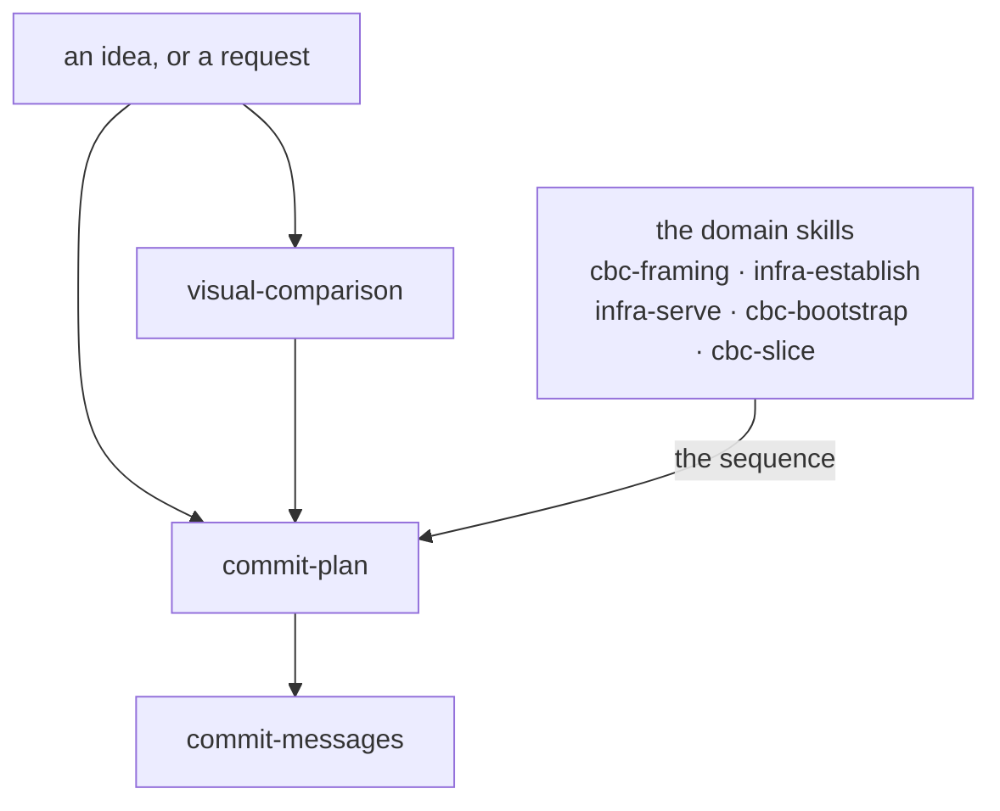

# Conventions

How the conventions that act in sequence during a piece of work
hand to each other, from an idea to committed work. The others
relate through what they govern, read or describe, and each states
those relations in its manual's *What this does not cover*. Which
conventions there are and what each covers is `ARCHITECTURE.md`
§1.2; what a convention is, how one is written and how one is added
is `docs/conventions/conventions/`.

## The chain

**Relations only** — every rule lives in a manual or a skill, and
nothing here restates one (CBC ADR-0032).

**Each fires at its own moment; the arrows say what hands to what,
not what you must pass through.** A typo fix reaches only
`commit-messages`. A settled decision needing four commits reaches
only `commit-plan`. A question about a diagram's shape reaches
`visual-comparison` from wherever it arose.

- **`visual-comparison`** fires when what is being chosen is how a
  structure is shown and the candidates can be rendered cheaply
  enough to look at. A choice that is not about showing something
  has no convention: it is decided and corrected while building,
  which the commit-plan skill's §4 and §5 carry,
  `delivery/container/.claude/skills/commit-plan/SKILL.md`.
- **`commit-plan`** fires when the work needs more than one commit.
  It plans the commits, not the change.
- **`commit-messages`** fires when you are writing any commit, in a
  plan or alone.

**The order *inside* a plan does not come from here.** It comes
from the domain skill that knows the work — `cbc-bootstrap` names a
five-step shape, `cbc-slice` runs specify → plan → build →
document, `infra-establish` has its walk. That division is why
`commit-plan` stays generic and a project on another stack can use
it unchanged.

**What the chain produces** is not on it: an ADR for a decision
with rejected options, a `temp/` draft for a measurement or a
comparison, and the commits themselves. The other conventions, and
the records they govern, are not stages of this and fire on their
own moments.
