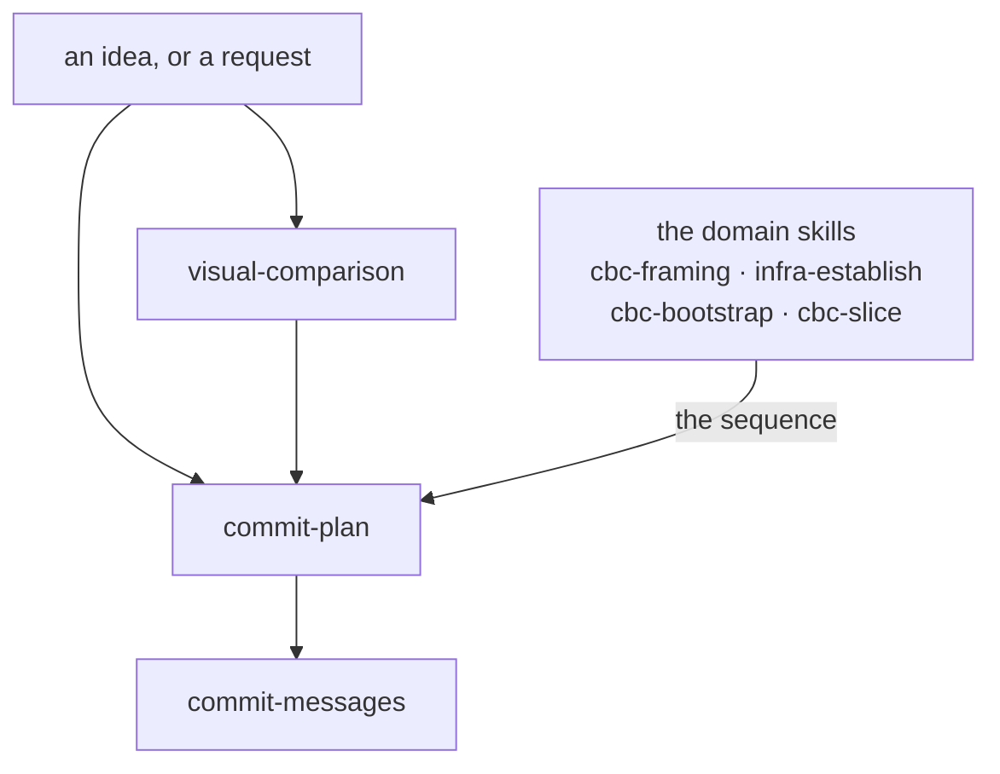

# Conventions

A convention is a rule you may break only with a reason. Here each
one is two things, kept apart:

- **A manual**, `conventions/<name>/README.md`. What this is, how it
  works, why, with pointers to the decisions. Written for a person
  and for the maintainer. Never shipped, never loaded into an agent
  by default.
- **Its artifacts**: what a project actually holds. A skill file for
  a rule bound to a moment; stubs and templates for rules that ride
  in the files a project is born with. The rules live here, one
  sentence each. The artifacts are real files in the starter kit,
  `delivery/container/`, and each convention's directory links to its own
  beside the manual.

The container is the master. Edit an artifact there and the
pointers under `conventions/` follow; this repo's own
`.claude/skills/` holds copies at a pin and takes the change at its
next update, like any project's (HANDBOOK ADR-0041). The container
is copied whole into a new project, as real files, which is why it
has to be the origin (HANDBOOK ADR-0040).

## The seven

| Convention | Manual | Artifacts |
|---|---|---|
| project-recording | [project-recording/](project-recording/) | the record stubs |
| commit-messages | [commit-messages/](commit-messages/) | a skill |
| repo-hygiene | [repo-hygiene/](repo-hygiene/) | the hygiene base; stack overlays stay here |
| commit-plan | [commit-plan/](commit-plan/) | a skill |
| convention-lifecycle | [convention-lifecycle/](convention-lifecycle/) | a skill: the kit's protocol, receiver side |
| agent-arrangement | [agent-arrangement/](agent-arrangement/) | the entry-file and decisions-log stubs |
| visual-comparison | [visual-comparison/](visual-comparison/) | a skill: how a structure is shown, settled by rendering |

## The chain

How they relate across a piece of work. **Relations only** — every
rule lives in a manual or a skill, and nothing here restates one
(CBC ADR-0032).



**Each fires at its own moment; the arrows say what hands to what,
not what you must pass through.** A typo fix reaches only
`commit-messages`. A settled decision needing four commits reaches
only `commit-plan`. A question about a diagram's shape reaches
`visual-comparison` from wherever it arose.

- **`visual-comparison`** fires when what is being chosen is how a
  structure is shown and the candidates can be rendered cheaply
  enough to look at. A choice that is not about showing something
  has no convention: it is decided and corrected while building,
  which `commit-plan` §4 and §5 carry.
- **`commit-plan`** fires when the work needs more than one commit.
  It plans the commits, not the change.
- **`commit-messages`** fires when you are writing any commit, in a
  plan or alone.

**The order *inside* a plan does not come from here.** It comes
from the domain skill that knows the work — `cbc-bootstrap` names a
five-step shape, `cbc-slice` runs specify → plan → build →
document, `infra-establish` has its walk. That division is why
`commit-plan` stays generic and a project on another stack can use
it unchanged.

**What the chain produces** is not on it: an ADR for a decision
with rejected options, a `temp/` draft for a measurement or a
comparison, and the commits themselves. The remaining four
conventions — `project-recording`, `repo-hygiene`,
`agent-arrangement`, `convention-lifecycle` and the records they
govern — are not stages of this and fire on their
own moments.

## A skill file

Opens with YAML frontmatter, which is what a skill loader reads:

```yaml
---
name: <the convention's name>
description: <when to read this file — the trigger>
requires: <conventions this one delegates to; omit if none>
---
```

- `description` says when to read the file, never what the rule is.
- `name` equals the directory name; registry entries and `requires`
  lines refer to the convention by it.
- `requires` names the conventions this one delegates rules to; a
  receiver lands a convention together with its chain.

## Writing an artifact

The reader is an agent in a project, holding a pinned copy and
opening it at the moment of use.

- A rule is one sentence in the imperative. Its why is the manual's
  or the ADR's.
- Cite no decision mid-sentence. A skill lists the decisions it
  rests on once, in a footer headed *Decisions*, each as
  `HANDBOOK ADR-nnnn`. A stub cites nothing.
- Say what a rule is not only when a consumer lived the misreading,
  and then name the run.
- A worked example in a code block is exempt from all of this.

The manual is free prose. It explains, points at the artifact and
the ADRs, and states no rule the artifact does not (HANDBOOK ADR-0039).

## The container's rules

- A convention entering or leaving the container updates the table
  above, the shipped-conventions table in `delivery/README.md`, and
  the birth entry in the container's decisions-log stub, in the
  same commit.
- A citation in any shipped file names the repo that decided it —
  `HANDBOOK ADR-nnnn` for a decision inherited from the handbook,
  `CBC ADR-nnnn` for one of ours — since a bare number names the
  reading repo's own decision.
- Only `delivery/container/` is copied into a run. Everything else
  under `delivery/` is about the delivery (CBC ADR-0029).

## Adding a convention

1. A directory `conventions/<name>/` with its `README.md`.
2. Its artifacts in the kit, and links to them from the directory.
3. An ADR for the decisions behind it.
4. A row in the table above; the container's tables and birth
   entry per the rules above.
5. A changelog entry prefixed with the convention name; a PLAN
   step, numbered by creation.
6. For a skill, this repo's own copy under `.claude/skills/` and a
   registry entry, landed as a first injection by
   convention-lifecycle §3, in its own agent-scoped commit
   (HANDBOOK ADR-0041).

## Where these files came from

Taken from the handbook, and this repo's since CBC ADR-0025: ours
to change when a rule here changes, with nothing tracking that repo
and no update from it owed a reading. That decision is the *why*;
what follows is what a reader — or a handbook agent asking what we
did — needs in order to act on it.

**Both ends of the anchor.** The bytes came from the handbook at
`ba7eaa4`, identical through their `8adb46f`, which is the last
state this repo was aligned with. They landed here at `9a1637d`.
One hash without the other is an excavation; with both it is a
command:

```bash
git diff -M 9a1637d..HEAD -- docs/conventions
```

If this directory is ever renamed, its old path is added to that
line in the same commit. A rename that does not land here leaves
the next reader a diff saying every file is new — which is what
`delivery/README.md` records happening to the container.

**Keep a manual true to the rule it explains.** A manual's only job
is to say why its rule is shaped as it is. If a rule in
`delivery/container/` changes and its manual here does not, the
manual lies — the kind of lie nothing catches, because a manual is
read rarely and by whoever is least sure. So the manual moves with
its rule, in the same commit.

**What did not come across.** Sixteen of the handbook's entries
here are symlinks into its kit, not files: each convention's
`SKILL.md`, the record stubs, the base hygiene templates. We hold
those artifacts at `delivery/container/`, so reproducing the links
would duplicate what we already have, and a manual's pointer to
"its artifact" resolves into `delivery/container/` instead. One
such pointer names `delivery/container/CLAUDE.md`, which our
container does not have — it ships the entry file at
`.claude/CLAUDE.md`. That is delta row 1 in `delivery/README.md`,
not a defect.

**What was corrected, 2026-09-19, and why it could not wait.** 66
bare `ADR-nnnn` citations across these eight files were prefixed
`HANDBOOK`. The rule above says a bare number names the reading
repo's own decision, so every one of them read as ours — and 22 of
the numbers exist here, pointing at something unrelated. A manual
citing `ADR-0005` meant Conventional Commits and read as *practice-born
executions pin as checked-against*. Nothing errors; a reader lands
somewhere plausible and wrong. The shipped rules had been prefixed
and these had not, which is what makes it an oversight rather than
a choice. Nine paths were repointed at our tree in the same pass.

**Which pointers get rewritten, and which do not**, since the
question will recur: whether the pointer leaves this directory.
Four that reached out into the repo are now written from the repo
root — two had never resolved, and two resolved *by accident*,
`../../models/` landing on `docs/models/` because that is where we
happen to keep them, which is the worse case because it breaks
silently the day something moves. The ten manual-to-manual links
stay relative: they resolve, and rewriting them would be a change
of voice rather than a correction. The rule behind both is that a
relative path means a different thing the moment a file is read
from a different root, which is every copy and every shipped file.

**No compare runs on a schedule.** Nothing upstream is owed a
reading (CBC ADR-0025). If a re-sync is ever attempted, the
coordinates above are where it starts, and
`git diff 8adb46f..<theirs> -- conventions` is the whole of what it
would have to read.
