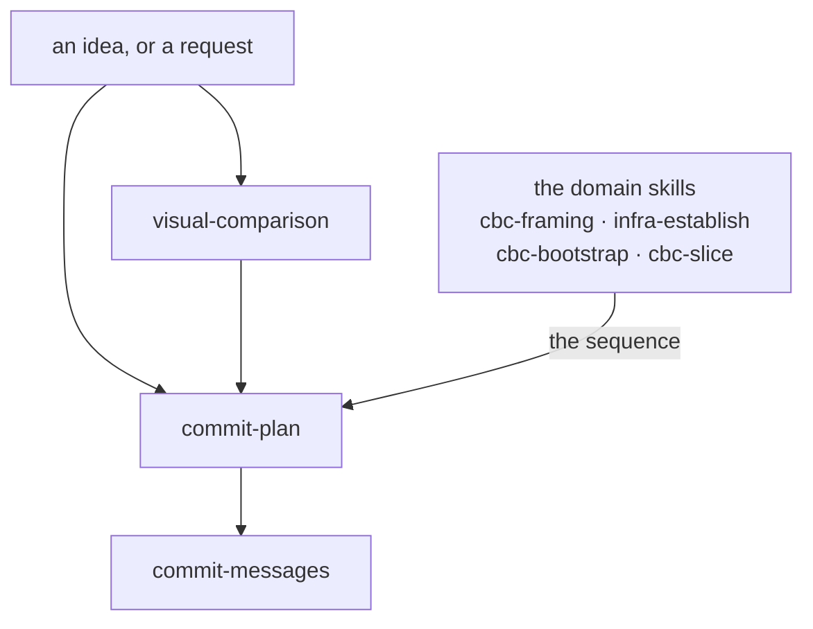

# Conventions

A convention is a rule you may break only with a reason. Here each
one is two things, kept apart:

- **A manual**, `conventions/<name>/README.md`. What this is, how it
  works, why, with pointers to the decisions. Written for a person
  and for the maintainer. Never shipped, never loaded into an agent
  by default.
- **Its artifacts**: what a project actually holds. A skill file for
  a rule bound to a moment; stubs and templates for rules that ride
  in the files a project is born with. The rules live here, one
  sentence each. The artifacts are real files in the starter kit,
  `delivery/container/`, and each convention's directory links to its own
  beside the manual.

The container is the master. Edit an artifact there and the
pointers under `conventions/` follow; this repo's own
`.claude/skills/` holds copies at a pin and takes the change at its
next update, like any project's. The container is copied whole into
a new project, as real files, which is why it has to be the origin.

## The eight

| Convention | Manual | Artifacts |
|---|---|---|
| project-recording | [project-recording/](project-recording/) | the record stubs |
| commit-messages | [commit-messages/](commit-messages/) | a skill |
| repo-hygiene | [repo-hygiene/](repo-hygiene/) | the hygiene base; stack overlays stay here |
| commit-plan | [commit-plan/](commit-plan/) | a skill |
| exchange | [exchange/](exchange/) | a rule shipped to the run; two skills and a shape held here |
| agent-arrangement | [agent-arrangement/](agent-arrangement/) | the entry-file and decisions-log stubs |
| visual-comparison | [visual-comparison/](visual-comparison/) | a skill: how a structure is shown, settled by rendering |
| shapes | [shapes/](shapes/) | a rule shipped to the run; this repo's shapes are its instances |

## The chain

How they relate across a piece of work. **Relations only** — every
rule lives in a manual or a skill, and nothing here restates one
(CBC ADR-0032).



**Each fires at its own moment; the arrows say what hands to what,
not what you must pass through.** A typo fix reaches only
`commit-messages`. A settled decision needing four commits reaches
only `commit-plan`. A question about a diagram's shape reaches
`visual-comparison` from wherever it arose.

- **`visual-comparison`** fires when what is being chosen is how a
  structure is shown and the candidates can be rendered cheaply
  enough to look at. A choice that is not about showing something
  has no convention: it is decided and corrected while building,
  which `commit-plan` §4 and §5 carry.
- **`commit-plan`** fires when the work needs more than one commit.
  It plans the commits, not the change.
- **`commit-messages`** fires when you are writing any commit, in a
  plan or alone.

**The order *inside* a plan does not come from here.** It comes
from the domain skill that knows the work — `cbc-bootstrap` names a
five-step shape, `cbc-slice` runs specify → plan → build →
document, `infra-establish` has its walk. That division is why
`commit-plan` stays generic and a project on another stack can use
it unchanged.

**What the chain produces** is not on it: an ADR for a decision
with rejected options, a `temp/` draft for a measurement or a
comparison, and the commits themselves. The remaining five
conventions — `project-recording`, `repo-hygiene`,
`agent-arrangement`, `exchange`, `shapes` and the records they
govern — are not stages of this and fire on their
own moments.

## A skill file

Opens with YAML frontmatter, which is what a skill loader reads:

```yaml
---
name: <the convention's name>
description: <when to read this file — the trigger>
requires: <conventions this one delegates to; omit if none>
foundation: the <name> convention
---
```

- `description` says when to read the file, never what the rule is.
- `name` equals the directory name; registry entries and `requires`
  lines refer to the convention by it.
- `requires` names the conventions this one delegates rules to; a
  receiver lands a convention together with its chain.
- `foundation` says what the file stands on now — for a convention's
  artifact, the convention by name. Every shipped skill and rule
  carries one; the exchange's manual §3 says what each kind holds.

## Writing an artifact

The reader is an agent in a project, holding a pinned copy and
opening it at the moment of use.

- A rule is one sentence in the imperative. Its why is the manual's
  or the ADR's.
- Cite no decision mid-sentence. A skill lists the decisions it
  rests on once, in a footer headed *Decisions*, each as
  `CBC ADR-nnnn`. A stub cites nothing.
- Say what a rule is not only when a consumer lived the misreading,
  and then name the run.
- A worked example in a code block is exempt from all of this.

The manual is free prose: the convention stated, from which the
artifact is made usable (`docs/master.md` §1). It explains and points
at the ADRs; the artifact says what a project does, and its
`foundation` line names the manual it derives from.

## The container's rules

- A convention entering or leaving the container updates the table
  above, the shipped-conventions table in `delivery/README.md`, and
  the birth entry in the container's decisions-log stub, in the
  same commit.
- A citation in any shipped file is `CBC ADR-nnnn`, since a bare
  number names the reading repo's own decision. A decision this
  repo inherited is adopted as ours before a shipped file cites it
  (CBC ADR-0038); a run holds no other repo to resolve a tag
  against.
- Only `delivery/container/` is copied into a run. Everything else
  under `delivery/` is about the delivery (CBC ADR-0029).
- A manual and its artifact move in the same commit. The artifact
  derives from the manual; when they disagree, neither is right by
  default — the disagreement is decided, practice being the
  evidence (`docs/master.md` §3), and whichever changes, the other
  follows at once. A manual left behind lies in the way nothing
  catches, because it is read rarely and by whoever is least sure.
- A pointer that leaves a convention's directory is written from
  the repo root; manual-to-manual links stay relative. A relative
  path means a different thing the moment a file is read from a
  different root, which is every copy and every shipped file — two
  such pointers once resolved only by accident, which is the worse
  case because it breaks silently the day something moves.

## Adding a convention

1. A directory `conventions/<name>/` with its `README.md`.
2. Its artifacts in the kit, and links to them from the directory.
3. An ADR for the decisions behind it.
4. A row in the table above; the container's tables and birth
   entry per the rules above.
5. A changelog entry prefixed with the convention name; a PLAN
   step, numbered by creation.
6. For a skill, this repo's own copy under `.claude/skills/` and a
   registry entry, in its own agent-scoped commit.
