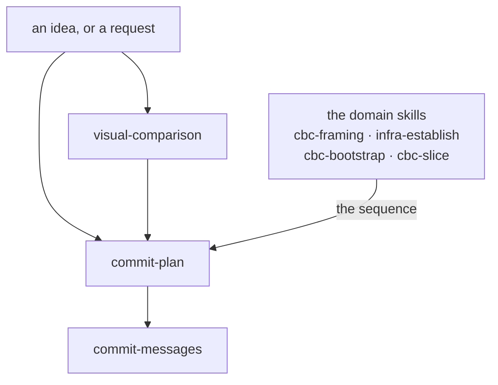

# Conventions

The nine conventions this repo holds, and how they relate across a
piece of work. What a convention is, how one is written and how
one is added is the `conventions` manual,
`docs/conventions/conventions/`.

## The nine

| Convention | Manual | Artifacts |
|---|---|---|
| project-recording | `docs/conventions/project-recording/` | the record stubs |
| commit-messages | `docs/conventions/commit-messages/` | a skill |
| repo-hygiene | `docs/conventions/repo-hygiene/` | the hygiene base; stack overlays stay with the deliverer |
| commit-plan | `docs/conventions/commit-plan/` | a skill |
| exchange | `docs/conventions/exchange/` | a rule shipped to the run; two skills and a rule held by the deliverer |
| agent-arrangement | `docs/conventions/agent-arrangement/` | the entry file and the decisions-log stub |
| visual-comparison | `docs/conventions/visual-comparison/` | a skill: how a structure is shown, settled by rendering |
| shapes | `docs/conventions/shapes/` | a rule shipped to the run; the deliverer's shapes are its instances |
| conventions | `docs/conventions/conventions/` | nothing shipped; the shape of a manual, held by the deliverer, and the `foundation` line every shipped file carries |

## The chain

How they relate across a piece of work. **Relations only** — every
rule lives in a manual or a skill, and nothing here restates one
(CBC ADR-0032).

**Each fires at its own moment; the arrows say what hands to what,
not what you must pass through.** A typo fix reaches only
`commit-messages`. A settled decision needing four commits reaches
only `commit-plan`. A question about a diagram's shape reaches
`visual-comparison` from wherever it arose.

- **`visual-comparison`** fires when what is being chosen is how a
  structure is shown and the candidates can be rendered cheaply
  enough to look at. A choice that is not about showing something
  has no convention: it is decided and corrected while building,
  which `commit-plan` §4 and §5 carry.
- **`commit-plan`** fires when the work needs more than one commit.
  It plans the commits, not the change.
- **`commit-messages`** fires when you are writing any commit, in a
  plan or alone.

**The order *inside* a plan does not come from here.** It comes
from the domain skill that knows the work — `cbc-bootstrap` names a
five-step shape, `cbc-slice` runs specify → plan → build →
document, `infra-establish` has its walk. That division is why
`commit-plan` stays generic and a project on another stack can use
it unchanged.

**What the chain produces** is not on it: an ADR for a decision
with rejected options, a `temp/` draft for a measurement or a
comparison, and the commits themselves. The remaining six
conventions — `project-recording`, `repo-hygiene`,
`agent-arrangement`, `exchange`, `shapes`, `conventions` and the
records they govern — are not stages of this and fire on their
own moments.
