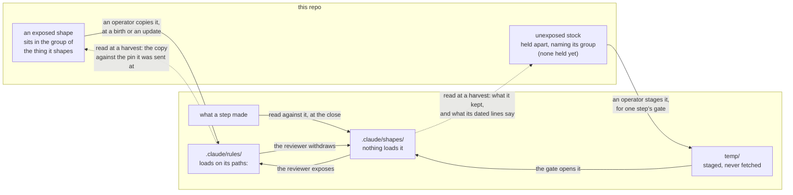
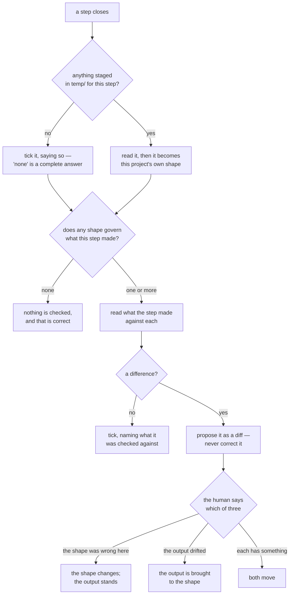

<!-- The shapes convention's manual: what a shape is, how one lives,
     and why the rule is the shape it is. Never shipped; a run holds
     the rule, `delivery/container/.claude/rules/shapes-lifecycle.md`,
     which binds. This describes and demands nothing; the rule
     derives from it. If the two disagree, neither is right by
     default: the disagreement is decided, practice being the
     evidence (docs/master.md §3), and whichever changes, the other
     follows in the same commit. Written here first (CBC ADR-0035) at
     the end of the set that made shapes real, from what the
     implementation turned out to be, and made the manual under
     CBC ADR-0037 rather than rewritten. Same rule as master.md:
     only what is checkable, and anything merely intended marked as
     intended.

     **Its pictures illustrate its prose and never carry a fact
     alone.** Measured once and found false: five claims lived only
     in a chart — who moves a shape, that a project fetches nothing,
     that a difference is proposed and never corrected, what a tick
     records, and that a delivery becomes the project's own shape.
     The prose grew to cover them. Read where Mermaid does not
     render, this file should lose the pictures and no facts.

     Delivered to nobody. What reaches a project is the rule, and
     an exposed shape as a pinned copy — never this. -->

# Shapes

**What a kind of output looks like, in whichever repository makes
it — its form, never its content — written from work that exists,
and held where its place decides its force.**

**What ships:** the rule, which a project holds at
`.claude/rules/shapes-lifecycle.md` and which loads when a file
under `.claude/shapes/` is touched. This page explains it; the rule
states it. What this repo holds of the convention is §4.

## 1. What a shape is

A **shape** says what a kind of output looks like: its form, never
its content. *Project*, below, means whichever repository makes the
output — a run, or this one.

The two halves matter equally. *Form* is what recurs — which parts a
record has, what each is for, what a worked example must contain.
*Never content* is what stops a shape check turning into a review of
the work: a shape can say a guarantee needs an example with real
numbers, and cannot say which numbers, or whether the guarantee is
any good.

*Found twice on 2026-09-26. A shape says what an output looks like
while it exists; when the output opens, extends and closes is the
owning convention's, and a shape that restates it is a copy of that
convention, and a copy that repeats is what drifts. The reading's
shape here restated the reading's lifecycle in its first section and
lost the sentences rather than gaining a clause; run 3's
`slice-record.md` opens with a section on how it is used that says
the same thing from its side. The rule now says it in one sentence.*

A shape is written from work that exists. Two ways one is born, and
neither ranks above the other: **it recurred**, so a pair is the
evidence and what they share is the shape; or **it was judged worth
keeping**, so one piece was rebuilt until it read well and someone
decided that should hold beyond here. What is ruled out is a shape
designed in advance from an idea of how work should go — everything
measured against it afterwards would be measuring the guess.

## 2. What a shape is not

The vocabulary already had four near neighbours, and a shape was
called each of them at some point before it got its own word. The
differences are the reason the entry exists.

- **Not a template.** A template's content is holes awaiting
  specifics, and you fill it in. A shape is read *against* finished
  work. Filling a shape in is the failure mode it warns about — the
  material that does not fit gets hidden as a completed form.
- **Not a specification.** A test can verify conformance to a
  specification. Nothing can test that a passage reads well, and a
  difference from a shape is a question rather than a failure.
- **Not a convention.** Deviating from a convention owes an
  explanation. A shape *wants* divergence: that is how it learns,
  and a difference may end with the shape changing rather than the
  output.
- **Not trial evidence.** This is the one that will be got wrong,
  because both are withheld and look alike. Their blindness runs
  opposite ways. Trial evidence is withheld **in order to stay**
  undelivered — a derivation that has seen it measures imitation
  instead of independence, so showing it destroys the measurement.
  A shape is withheld **only until a gate**, after which being in
  front of the next writer is the entire point.

## 3. Exposure, and why the place is the mechanism

A shape is **exposed** or **unexposed**, and the axis is not how
settled it is. Both go on changing. The axis is whether the shape is
in front of whoever does the work.

| | Where | What happens |
|---|---|---|
| **Unexposed** | `.claude/shapes/` | nothing loads it; it is opened at a gate |
| **Exposed** | `.claude/rules/`, with `paths:` | loads whenever a matching path is touched |

The directory is not a filing decision. It *is* the force: the same
file binds in one place and merely describes in the other, and
nothing else in the arrangement works that way: a shape is the one
thing here whose force is decided by where it sits rather than
fixed.

Unexposed is chosen while it still matters what the work produces
*without* the shape — most of all for the first output of a kind,
which is the only one nothing has influenced yet. Exposed is chosen
when conformance is what is wanted, and keeping the shape out of
sight would only make the next output re-derive it badly.

**The reviewer moves a shape, in both directions, and no count
does.** Exposing one and withdrawing it again are judgements. A
count can only prompt the question — a shape that has taken nothing
up across several closes has probably stopped teaching, one that
keeps changing probably still is — and the shape's own dated lines
are what the question is asked against. Changing an exposed shape
does not withdraw it; it returns to `.claude/shapes/` only when
someone decides the question is open again.

## 4. This repo's seat

This repo makes outputs too — a reading is one — but it has no
steps and no gates. So of §3 it runs the exposed case only:
a shape here is a rule under `.claude/rules/` with its own `paths:`,
marked as a shape by its Governs line, loading while the file it
governs is written. There is no `.claude/shapes/` here, nothing is
staged to this repo, and the rule's §4 — what a gate does with what
arrives in `temp/` — has no moment to fire on. The reviewer moves a
shape, as the rule says, and here that means only writing one or
withdrawing it. One exists: `.claude/rules/exchange-reading.md`, the
form of a reading, which is the exchange's artifact and this
convention's instance.

Unexposed stock, when this repo holds any, is held apart from the
groups and names its group (§5); today it holds none, and no
directory is made ahead of a first occupant.

## 5. Where a shape lives, between repositories

Stated here once; `delivery/README.md` points here. Inside a
project, §3. Between repositories, a shape follows the
group of the thing it shapes — the same rule by which a skill
belongs to exactly one group and travels whole. A slice record's
shape is `method/`; a Spring harness file's is `spring-postgres/`; a
devlog entry's or a commit plan's is `container/`. A run on another
stack receives the first and never the second, and that falls out of
the groups rather than being enforced on top of them.

Only an exposed shape travels that way, as a pinned copy. An
unexposed one is in no birth copy at all — it would spend the only
independence there is — so it is held apart, names its group, and
reaches a project as a delivery staged at a gate.

**A project fetches nothing.** It holds no address for its deliverer
and reaches no repository but its own; what arrives, arrives because
a person asked for it and staged it. So the gate's act is local and
always the same: look in `temp/`. And what it finds does not stay a
delivery — after the gate has read it, the result **becomes that
project's own shape**, whether it came back unchanged, changed by
what the project found, or merged with what was already there. The
staging leaves; the shape stays, with dated lines saying what
arrived, what was taken and what was refused.

**Why kept rather than deleted.** Deleting would only hide what has
already been read. Keeping it makes the next gate cheap and the
reconciliation possible: the deliverer reads the project's version
and its dated lines against what it sent, and decides whether to
take the change or leave its own standing.

**Staleness, honestly.** A kept copy is a snapshot, current only as
of the delivery it came from, and nothing in a project can tell
when the deliverer's has moved on. A fresh delivery is the only
refresh, and asking for one is a person's act on this side, not the
project's.

**A shape is written in two separable layers, and only one of them
travels well.** The skeleton and what it encodes are general by
construction: they say *a worked example with real numbers from this
system*, not which numbers. The illustrations filling the
placeholders are the project's, and are marked as such. A reader
takes the first and leaves the second, and nothing has to be
rewritten at the hand-off to make that possible. This is why the
rule asks a project to mark its illustrations apart.

*Intended: staging a shape for a gate is a third act of the
exchange, beside read and deliver, and not a delivery. It reads only
which step the run stands at; it moves neither the pin nor the
read-through; its note is one line naming the shape and the step;
and what it stages becomes the project's own after the gate reads it,
never a pinned copy — so `delivered-copies.md`, which loads on
`temp/` and says to take what is there whole, must not apply to it.
No unexposed shape exists on either side, so nothing fires wrongly
today. Its skill, and the copies rule's exclusion, are written from
the first staging, not before (CBC ADR-0037 decision 5).*

**Birth and delivery, drawn.** Where a shape of each kind sits here,
and the two different moments at which each reaches a run. Every
arrow that crosses is carried by a person: nothing in this repo
reaches into a run, and nothing in a run reaches out.

**The dashed lines back are a reading, and the difference in the
line is the point.** Nothing is sent upward and nothing is fetched:
this repo opens a run's tree read-only and looks at both places — at
`.claude/shapes/` for what the project kept and what its dated lines
say it refused, when a backlog line of the run's offers it, and at
`.claude/rules/` for the copy against the pin it was sent at, which
the exchange reads at every reading. The run never reads this repo at all. That asymmetry
is the whole traffic model, and a solid arrow in one direction with a
dashed one in the other is the only part of this picture that states
it rather than captioning it.

What travels upward is a **finding**, never a proposal: one project
saying what it arrived at — and it travels by being *read*, not by
being sent. A project offers by keeping its shape where its own
records are and pointing at it from its backlog, and this repo reads
it at the next reading (the exchange, §6). What must not travel is a status, not a
wording — a shape handed down as a standard is inherited rather than
derived, and the next project's own answer is lost before it is
written. The protection is in how a shape moves, not in how vaguely
it is phrased.

## 6. How a shape is used, and what a difference means

**Use, drawn.** What a gate actually does when a step closes: look in
`temp/`, find which shapes govern what was made, read, and settle
each difference. Two of its endings are easy to misread as gaps in
prose and are plainly endings here — "nothing was staged" is a
complete answer, and "no shape governs this" means nothing is
checked and that is correct.

A gate reads what a step made against every shape governing it, and
**what it ticks records what it checked against** — including that
nothing was staged and nothing governed, which are answers rather
than omissions. A tick with no note is what would be wrong.

A difference is **proposed as a diff and never corrected**. That is
the whole guard against a shape check becoming a review of the work:
the gate says where two things differ, and a human says what that
means. It ends one of three ways, decided per difference and never
by a policy of preferring one side: **the shape
was wrong here**, so it changes and the output stands; **the output
drifted**, so it is brought to the shape; or **each has something**,
and both move.

Two things follow either way. Outputs closed before the change are
not reopened — each looks like what the shape asked for when it was
written, and the difference between them records when the shape
changed. And an exposed shape that changes stays exposed; a dated
line is not a withdrawal.

**A shape record that never changes is either finished or unread.**

## 7. What you may disagree with here

All of it — a manual demands nothing. Disagreeing with §1's two
births, or with §2's four boundaries, violates nothing and costs
nothing; the worst case is that this file is wrong and wants
correcting, and a run that contradicts it may have found its flaw
(`docs/master.md` §3).

What does bind is the rule, and it is short: how shapes live, what a
gate does, and what the word means. This exists so that a month from
now the rule is recallable — so that "why is this a directory and
not a rules file?" has an answer that is not archaeology.

## 8. What this does not cover

What this repo stages to whom — no unexposed shape is held, and the
place for them arrives with the first. The gate items that make a
project meet a shape at a step's close, which belong to whatever
defines the project's steps. And whether `docs/baselines/` holds
anything that is a shape rather than trial evidence: §2 draws the
line, and the sorting against it is its own work.

---

## What this is made usable as

**Shapes are a convention**: this is its manual, which never ships,
and what a repo holds is below. The first convention with no skill:
its artifact is a rule, because a shape's moment is a path being
touched.

- **`shapes-lifecycle.md` — a rule, the run's, shipped** in the
  container at `.claude/rules/`, loading on `.claude/shapes/**`. §1
  to §3 and §6, from the run's seat, with the definition repeated
  because a run cannot open this page.
- **This repo's shapes — instances, not copies.** Rules under
  `.claude/rules/` with a Governs line; `exchange-reading.md` today.
  They follow §4 and hold no copy of the shipped rule, which has
  nothing here to load on.
- **`delivery/README.md` — a pointer.** Two sentences on placement
  and this page's §5 for the rest.

What derives from this page is that list. A change here walks it;
a change forced in one of them is checked back against this page.

*Does the name hold? Every section is about a shape — what one is,
where it sits, who moves it, what a difference with one means. It
held.*
