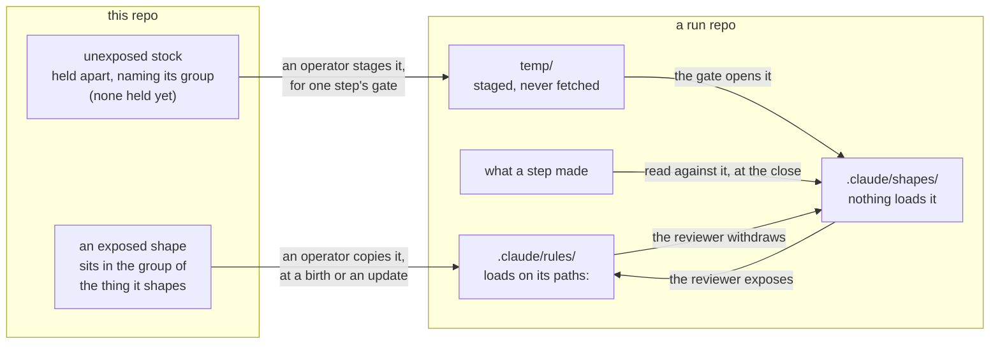
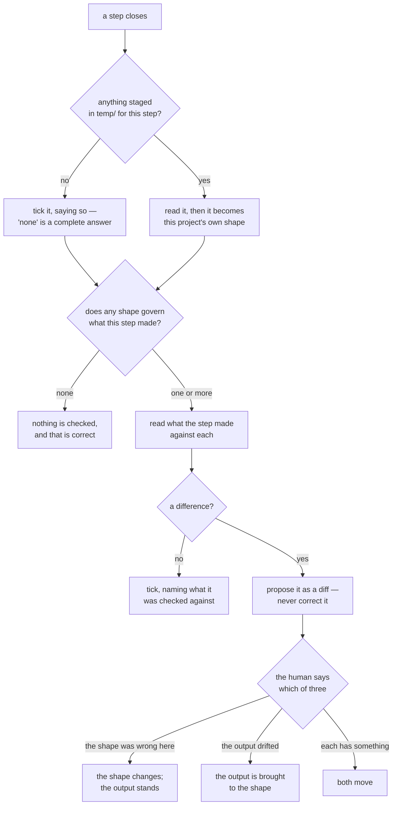

<!-- This repo's, written here (CBC ADR-0035) rather than taken from
     anywhere. It describes and demands nothing: what binds is the
     rule, `delivery/container/.claude/rules/shapes-lifecycle.md`,
     and where a shape sits is `delivery/README.md`. If this file
     and either of those disagree, they are right and this is
     wrong — say so here and fix it.

     Written at the end of the set that made shapes real, from what
     the implementation turned out to be. Written earlier it would
     have been a guess that the work then had to correct.

     Delivered to nobody. `docs/models/` is this repo's (ADR-0026);
     what reaches a project is the vocabulary entry, the rule, and
     the placement — never this. -->

# Shapes Model

## 1. What a shape is

A **shape** says what a kind of a project's output looks like: its
form, never its content.

The two halves matter equally. *Form* is what recurs — which parts a
record has, what each is for, what a worked example must contain.
*Never content* is what stops a shape check turning into a review of
the work: a shape can say a guarantee needs an example with real
numbers, and cannot say which numbers, or whether the guarantee is
any good.

A shape is written from work that exists. Two ways one is born, and
neither ranks above the other: **it recurred**, so a pair is the
evidence and what they share is the shape; or **it was judged worth
keeping**, so one piece was rebuilt until it read well and someone
decided that should hold beyond here. What is ruled out is a shape
designed in advance from an idea of how work should go — everything
measured against it afterwards would be measuring the guess.

## 2. What a shape is not

The vocabulary already had four near neighbours, and a shape was
called each of them at some point before it got its own word. The
differences are the reason the entry exists.

- **Not a template.** A template's content is holes awaiting
  specifics, and you fill it in. A shape is read *against* finished
  work. Filling a shape in is the failure mode it warns about — the
  material that does not fit gets hidden as a completed form.
- **Not a specification.** A test can verify conformance to a
  specification. Nothing can test that a passage reads well, and a
  difference from a shape is a question rather than a failure.
- **Not a convention.** Deviating from a convention owes an
  explanation. A shape *wants* divergence: that is how it learns,
  and a difference may end with the shape changing rather than the
  output.
- **Not trial evidence.** This is the one that will be got wrong,
  because both are withheld and look alike. Their blindness runs
  opposite ways. Trial evidence is withheld **in order to stay**
  undelivered — a derivation that has seen it measures imitation
  instead of independence, so showing it destroys the measurement.
  A shape is withheld **only until a gate**, after which being in
  front of the next writer is the entire point.

## 3. Exposure, and why the place is the mechanism

A shape is **exposed** or **unexposed**, and the axis is not how
settled it is. Both go on changing. The axis is whether the shape is
in front of whoever does the work.

| | Where | What happens |
|---|---|---|
| **Unexposed** | `.claude/shapes/` | nothing loads it; it is opened at a gate |
| **Exposed** | `.claude/rules/`, with `paths:` | loads whenever a matching path is touched |

The directory is not a filing decision. It *is* the force: the same
file binds in one place and merely describes in the other, and
nothing else in the arrangement works that way. That is why
`artifact-kinds` gives shape the only entry whose force is decided
by placement rather than fixed.

Unexposed is chosen while it still matters what the work produces
*without* the shape — most of all for the first output of a kind,
which is the only one nothing has influenced yet. Exposed is chosen
when conformance is what is wanted, and keeping the shape out of
sight would only make the next output re-derive it badly.

## 4. Where a shape lives, between repositories

Inside a project, §3. Between repositories, a shape follows the
group of the thing it shapes — the same rule by which a skill
belongs to exactly one group and travels whole. A slice record's
shape is `method/`; a Spring harness file's is `spring-postgres/`; a
devlog entry's or a commit plan's is `container/`. A run on another
stack receives the first and never the second, and that falls out of
the groups rather than being enforced on top of them.

Only an exposed shape travels that way, as a pinned copy. An
unexposed one is in no birth copy at all — it would spend the only
independence there is — so it is held apart, names its group, and
reaches a project as a delivery staged at a gate.

**Birth and delivery, drawn.** Where a shape of each kind sits here,
and the two different moments at which each reaches a run. Every
arrow that crosses is carried by a person: nothing in this repo
reaches into a run, and nothing in a run reaches out.

What travels upward is a **finding**, never a proposal: one project
saying what it arrived at. What must not travel is a status, not a
wording — a shape handed down as a standard is inherited rather than
derived, and the next project's own answer is lost before it is
written. The protection is in how a shape moves, not in how vaguely
it is phrased.

## 5. How a shape is used, and what a difference means

**Use, drawn.** What a gate actually does when a step closes: look in
`temp/`, find which shapes govern what was made, read, and settle
each difference. Two of its endings are easy to misread as gaps in
prose and are plainly endings here — "nothing was staged" is a
complete answer, and "no shape governs this" means nothing is
checked and that is correct.

A gate reads what a step made against every shape governing it. A
difference is a question, and it ends one of three ways, decided per
difference and never by a policy of preferring one side: **the shape
was wrong here**, so it changes and the output stands; **the output
drifted**, so it is brought to the shape; or **each has something**,
and both move.

Two things follow either way. Outputs closed before the change are
not reopened — each looks like what the shape asked for when it was
written, and the difference between them records when the shape
changed. And an exposed shape that changes stays exposed; a dated
line is not a withdrawal.

**A shape record that never changes is either finished or unread.**

## 6. What you may disagree with here

All of it — that is what makes this a model rather than a rule.
Nothing in this file has force. Disagreeing with §1's two births, or
with §2's four boundaries, violates nothing and costs nothing; the
worst case is that this file is wrong and wants correcting.

What does bind is elsewhere and is short: the rule says how shapes
live and what a gate does, `delivery/README.md` says where one
sits, and `artifact-kinds` gives the word. This exists so that a
month from now the rule is recallable — so that "why is this a
directory and not a rules file?" has an answer that is not
archaeology.

## 7. What this does not cover

Which shapes this repo holds, and what it stages to whom — there are
none yet, and the place for them arrives with the first. The gate
items that make a project meet a shape at a step's close. And
whether `docs/baselines/` holds anything that is a shape rather than
trial evidence: §2 draws the line, and the sorting against it is
its own work.
