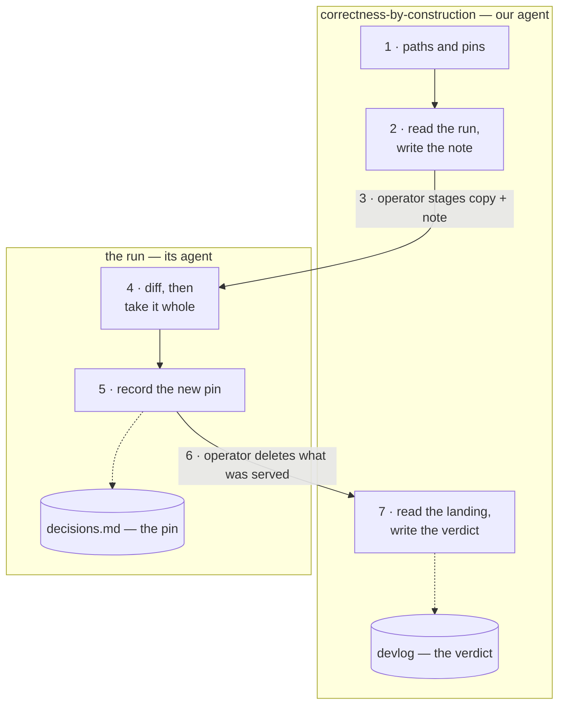
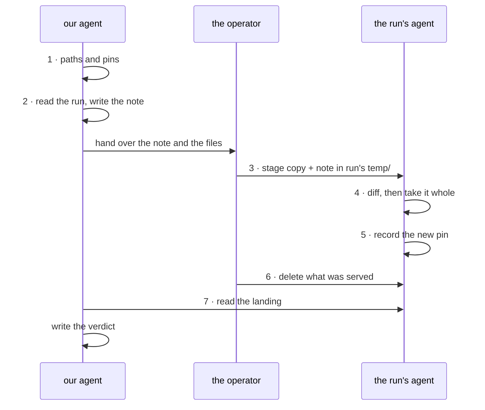

# What the shape must carry — bundle-update.md

Draft for a comparison, on ADR-0027's method: state what the thing
must carry, render candidates against it, let the render decide.
ADR-0027 decision 5 names this — the second artifact whose format
is in question — as the trigger for asking whether the method is a
convention. Delete once the comparison is settled.

## The defect it answers

`bundle-update.md` is structured — seven numbered steps, role
markers, six bash blocks — and the structure is invisible, because
each step's skeleton sits under 20–50 lines of its own reasoning.
Asked "why the diff in step 7", a reader had to be told; the answer
was mid-paragraph. The reasoning is not the problem and must not be
stripped: it is load-bearing at execution time, unlike a
convention's, which is why the manual-and-rule split does not fit
here.

So the shape is an *entry point*, not a replacement. The prose stays
whole underneath it.

## The question this trial asks, which is wider than last time

ADR-0027 asked which dialect draws a settled picture. Here, whether
it should be a picture at all is open. The requirements below are
therefore written as what a reader must get, not what a picture must
show — otherwise they decide the answer in advance.

## Requirements

1. **The seven steps in order**, findable by number, so a reader
   mid-procedure can locate where they are and drop back into the
   prose for that step.
2. **Who does each** — three actors, and they are not
   interchangeable: this repo's agent, the operator, the run's
   agent.
3. **The repo boundary** — two repos, two `temp/` directories, and
   nobody reaching into anybody. This is the rule the procedure
   exists to keep, so a shape that hides it is worse than no shape.
4. **The two records written**, and that they are one per side: the
   run's decisions entry at step 5, our devlog verdict at step 7.
5. **What is conditional** — the container half travels only when it
   moved; the four conventions are staged only then.
6. **It must cost less to edit than it costs to read.** ADR-0027's
   whole case against the ASCII was recurring edit cost. A shape
   that goes stale is worse than none, because it will be believed.

## Candidates to render

- **A. Step index.** Seven lines, numbered, actor in parentheses.
- **B. Table.** step | actor | does | writes.
- **C. Mermaid flowchart**, two subgraphs for the two repos.
- **D. Mermaid `sequenceDiagram`**, three actors, ordered messages
  — the dialect meant for a handoff protocol, which is what this
  is. Untried here.

## How it is judged

Each candidate rendered, then read against requirements 1–6 with a
pass or fail per line and the reason. A candidate that holds all
six wins. If two hold all six, requirement 6 breaks the tie. If
none does, the prose stays as it is and that is a result, not a
failure — the same way option 1 stayed the fallback last time.

---

# The candidates, rendered

Written 2026-09-18. A, B are readable as source; C and D must be
rendered before their verdicts count — last time the render, not
the argument, is what rejected `block-beta`. Verdicts below marked
**(predicted)** are waiting on that.

## A. Step index

```
1. Set the paths and capture the pins.              (operator)
2. Read the run, then write the note.               (our agent)
3. Stage the copy and the note in the run's temp/.  (operator)
4. The run evaluates and takes it whole.            (run's agent)
5. The run records the new pin.                     (run's agent)
6. Delete what was served.                    (operator or the run)
7. Read the landing, and write the verdict.         (our agent)
```

| req | verdict | why |
|---|---|---|
| 1 order | pass | |
| 2 actors | pass | named, but as a parenthetical |
| 3 boundary | **fail** | inferable from actor names, shown nowhere |
| 4 records | **fail** | "records the pin", "write the verdict" — that they are one per side is not visible |
| 5 conditional | **fail** | absent |
| 6 edit cost | pass | cheapest of the four: seven lines |

## B. Table

| # | who | does | writes |
|---|---|---|---|
| 1 | operator | set paths, capture both pins | — |
| 2 | our agent | read the run, write the note | the note, our `temp/` |
| 3 | operator | stage copy + note in run's `temp/` | — |
| 4 | run's agent | diff, then take it whole | its working tree |
| 5 | run's agent | record the new pin | **its `decisions.md`** |
| 6 | operator or run | delete what was served | — |
| 7 | our agent | read the landing, write the verdict | **our `devlog`** |

| req | verdict | why |
|---|---|---|
| 1 order | pass | |
| 2 actors | pass | own column; the handoff at 4 and back at 7 is legible |
| 3 boundary | **partial** | the who/writes columns imply it; nothing states that nobody crosses |
| 4 records | **pass, best of the four** | the `writes` column makes one-per-side unambiguous |
| 5 conditional | **fail** | needs a fifth column, which costs req 6 |
| 6 edit cost | pass | one row per step |

## C. Mermaid flowchart, two subgraphs



**The finding that only building it produced.** Two subgraphs force
every node into exactly one repo, and steps 3 and 6 belong to
neither — the operator works in both. Placing them in either box
would be a lie. The fix is not a third box, which would read as a
third repo: the operator is not a *place*, it is the transport, so
those two steps become the labels on the two crossing arrows. That
is a modelling choice, not a layout trick, so ADR-0027 decision 2
is not fired by it.

| req | verdict | why |
|---|---|---|
| 1 order | pass (predicted) | numbered nodes, top to bottom |
| 2 actors | pass | two as boxes, the operator as the crossings |
| 3 boundary | **pass, best of the four** (predicted) | the boundary *is* the subgraph, and the only two things crossing it are a human carrying files |
| 4 records | pass (predicted) | a cylinder inside each repo |
| 5 conditional | **fail** | no room without clutter |
| 6 edit cost | pass | no character counting; cheaper than the ASCII it would imitate |

## D. Mermaid sequenceDiagram



**It fails, and for a reason worth keeping.** Five of the seven
steps are an actor working alone, which renders as a self-loop: the
dialect is built for messages between actors and this procedure is
mostly not messages. Worse, step 7 has to be drawn as an arrow from
us into the run — because that is the only way a sequence diagram
expresses "our agent reads the run". But a read is not a call, and
the arrow says it is. The shape does not merely omit requirement 3,
**it asserts the opposite of it**: the one rule the procedure exists
to keep, drawn as broken. That is the spec's "worse than no shape".

| req | verdict | why |
|---|---|---|
| 1 order | pass | order is the dialect's whole axis |
| 2 actors | **pass, best of the four** | actors are the primary dimension |
| 3 boundary | **fail, actively** (predicted) | a read-only reading renders as a call into the other repo |
| 4 records | partial | no container, so a record cannot sit in a side |
| 5 conditional | **fail** | absent |
| 6 edit cost | pass | |

## Standing

C holds five of six; B holds four and owns requirement 4 outright.
D was the one worth trying and is the one to reject — the same
service `block-beta` did last time.

**Requirement 5 failed for every candidate**, which is evidence
about the requirement rather than about the four. A conditional is
a branch with a reason attached, and the reason is what makes it
decidable; a shape that carries the branch without the reason
invites the wrong call. It belongs in the prose, where it already
is. Proposed: strike requirement 5 and re-judge — C at five of
five, B at four of five.

**Not yet settled, and it is what decides C:** whether the two
crossing arrows read as *carried across a wall* or merely as two
more arrows. That is a render question, on a screen, and no
reasoning here substitutes for it.
