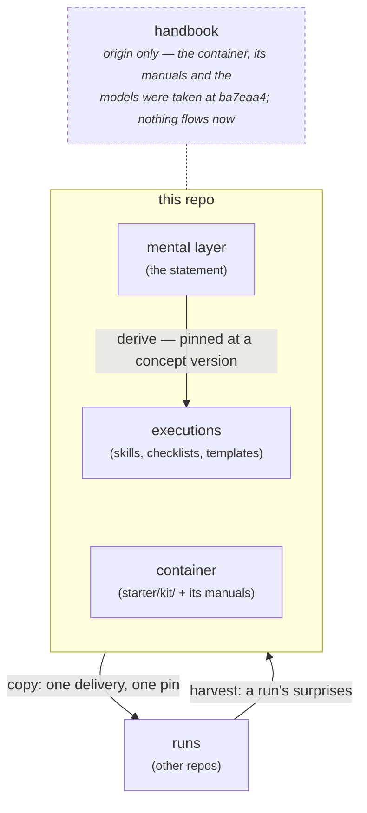
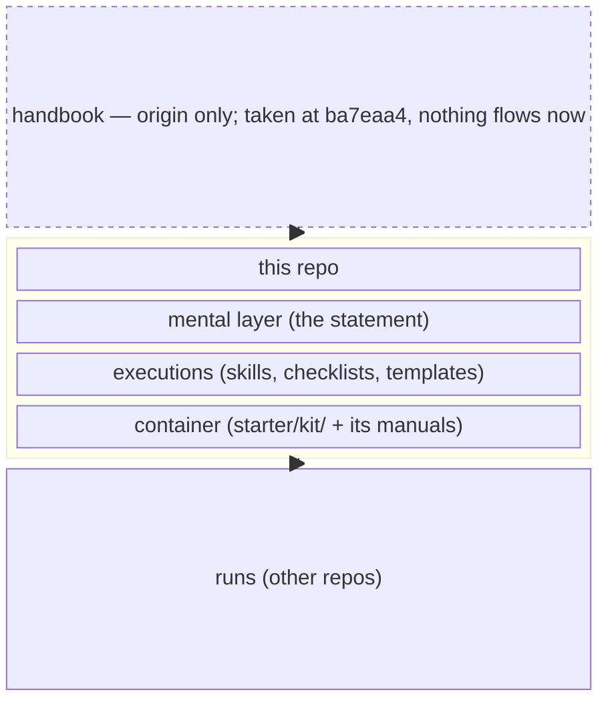

# Diagram candidates for ARCHITECTURE.md

Open this in IDEA's markdown preview. Three renderings of the same
picture. Delete this file once one is chosen.

What the picture has to carry, so we judge against something:

1. Three layers **stacked in derivation order** — the statement
   comes first, executions derive from it, the container sits with
   them. The vertical order is the meaning, not decoration.
2. All three **inside one boundary**, because "this repo holds
   them" is the claim.
3. Two flows to the runs tier, **opposite directions**, differently
   labelled — delivery down, harvest up.
4. The handbook **present but attached to nothing**. It is origin,
   not upstream. A reader must not be able to mistake it for a
   channel.

---

## A — what is in the file now (ASCII)

```
  handbook ╌╌╌╌ origin only: the container, its manuals and the
                models were taken at ba7eaa4. Nothing flows now.
┌────────────── this repo ──────────────────────┐
│  mental layer   (the statement)               │
│      │ derive — pinned at a                   │
│      ▼ concept version                        │
│  executions     (skills, checklists,          │
│                  templates)                   │
│  container      (starter/kit/ + its manuals)  │
└──────┬──────────────────────▲─────────────────┘
  copy │ one delivery,        │ harvest: a run's
       ▼ one pin              │ surprises
     runs   (other repos) ────┘
```

---

## B — Mermaid flowchart with a subgraph



---

## C — Mermaid block-beta



---

## What to look for

**B** should win on labelled arrows — the four flows all carry
words, and Mermaid places them for you. Watch whether the two
arrows between the repo box and `runs` come out as a clean pair or
overlap into one muddle, and whether the dotted handbook line reads
as "not a channel" or just as "a thinner channel".

**C** is the dialect meant for stacked blocks, so it should hold the
vertical order best. Its weakness is arrows: block diagrams carry
them poorly, so requirement 3's labels are likely to be lost. If C
renders the stack well but drops the labels, that is the trade in
front of us.

**A** holds all four requirements exactly, because every character
was placed by hand. That is also its whole cost.

**The thing to decide is not which is prettiest.** It is whether
either B or C holds requirement 1 and 4 without being nudged — the
vertical order, and the handbook reading as detached. If they need
hand-tuning to hold meaning, we have traded character-counting for
layout-engine-fighting and gained nothing.
