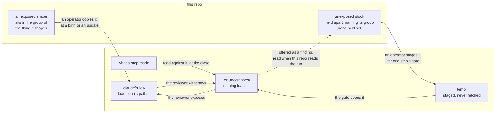
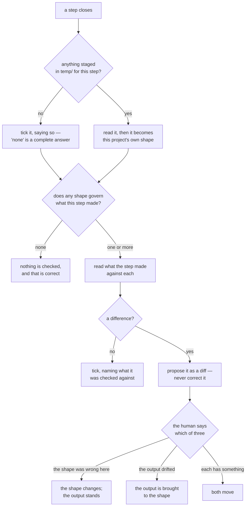
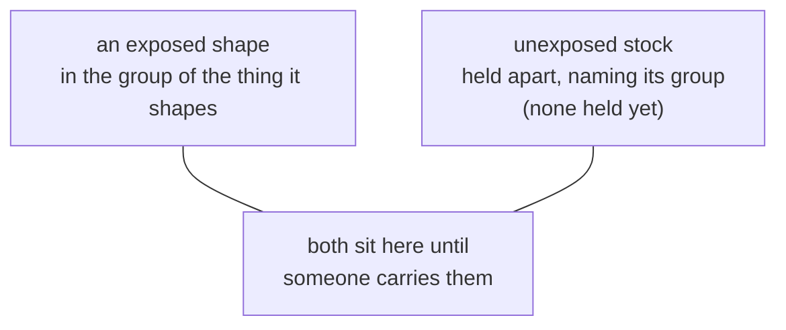
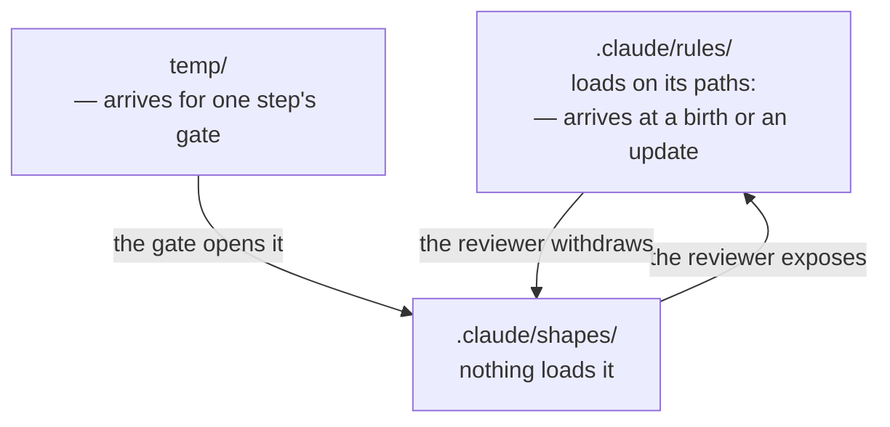

<!-- Draft for step 8a. Candidate 1 only — the reviewer asked to see
     a flowchart before deciding whether a comparison is wanted at
     all. Deleted once the question is settled; history keeps it. -->

# Does the shapes model want a picture?

## What a reader must get

Written as what the reader must come away with, not what a form must
show, so a non-picture can still win.

- **R1** — that the same file binds in one place and merely describes
  in another, and that the *place* is what decides which.
- **R2** — that an unexposed shape reaches a run only at a gate, and
  an exposed one at a birth or an update. Two different moments.
- **R3** — that **nothing in this repo reaches into a run.** An
  operator carries; the run reads its own tree. A picture that draws
  us reaching in states the opposite of the rule, and that mistake
  has been made here before (ADR-0027, ADR-0028).
- **R4** — that a shape moves between the two places inside a run,
  in both directions, by the reviewer's judgement.
- **R5** — that what comes back the other way is a finding, offered
  and never pushed.
- **R6** — *added by the reviewer at candidate 1's boundary, and it
  is the one that mattered:* **what a shape is for.** That a gate
  looks in `temp/`, that what the step made is read against whatever
  governs it, that a difference is proposed and never corrected, and
  that it ends one of three ways with the human choosing. R1–R5 are
  all residence and movement — where a shape lives and how it
  travels. None of them asked what it is *used* for, which is the
  only part a reader has to act on.

## Candidate 1 — flowchart

## Candidate 2 — the gate, and what a difference does

## Candidate 1b — the two repos, with nothing crossing

The same content as candidate 1, with R3 answered structurally
rather than by a label. Nothing crosses because there are two
pictures, and what carries between them is a sentence.

**What this repo holds.**

Between the two: **a person copies files across.** At a birth or an
update an exposed shape is copied into the run's `.claude/rules/`;
for one step's gate an unexposed one is staged into the run's
`temp/`. Neither repo reaches the other, and neither picture shows
an arrow that leaves it.

**What a run finds, and what it does with it.**

### What building 1b found

- **The obvious Mermaid way to build it is disqualified by our own
  list.** One picture with two unconnected subgraphs needs `~~~`
  invisible links to sit them side by side, and the lesson list says
  a candidate needing invisible links or spacer nodes has lost
  (ADR-0027 decision 2). So 1b is not one picture at all — it is two
  pictures and a sentence, and that is the only form of it that does
  not fight the notation.
- **That may be the answer rather than a compromise.** R3 stops
  being a claim a label has to carry and becomes a fact about the
  page: there is no arrow out of either picture, because there is no
  arrow out of either repo.
- **What it costs: the two moments get harder to see.** Candidate 1
  put "at a birth or an update" and "for one step's gate" on arrows,
  where a reader meets them in motion. Here they are captions inside
  the run's boxes, arriving already landed. R2 is weaker.
- **And a page with three pictures on it is now the real question.**
  1b is two, candidate 2 is a third. Whether a model carries three
  pictures, or whether 1b's first half is better as the prose it
  nearly already is, is what the render has to settle.

## What building it already shows

Judgements to make by looking, not by reasoning about it.

- **R3 is the one at risk, and the picture may fail it.** Every
  arrow from `HERE` to `RUN` is drawn as though this repo acts on the
  run. The labels say "an operator copies", which is the fix
  ADR-0028 found — the operator is transport, not a place — but a
  reader takes the arrow before the label. **This is the requirement
  to judge first.**
- **The dashed return arrow is the same problem mirrored.** Run to
  us, labelled read-only. It is the shape of the mistake
  `sequenceDiagram` made in ADR-0028. It may still be wrong here.
- **The steps and gates asked for are not in it.** Only "at the
  close" and "the gate opens it" survive, as labels. Putting a
  project's plan, its steps and their gates into this same picture
  would carry two subjects at once. That is evidence for two
  pictures, or for this one plus prose — not yet a verdict.
- **Candidate 2 may be the stronger of the two, and that inverts the
  ask.** It is a decision with branches, which is what a flowchart is
  actually for; candidate 1 is a residence map whose content lives in
  its captions. If only one picture survives, the evidence so far
  points at the second. **This is a prediction and wants a render.**
- **The two do not overlap**, which is the argument for keeping both
  rather than merging: one answers *where does a shape live and how
  does it get here*, the other *what happens when a step closes*. The
  second cites `temp/` and `.claude/shapes/`, which the first
  defines. Read in that order they compose; merged they would carry
  two subjects.
- **R1 is carried by node text, not by the drawing.** "nothing loads
  it" and "loads on its paths:" are captions; the picture itself
  draws two boxes that look alike. A table would state that
  contrast in a column and might beat the picture on R1 alone.

## Not yet done

No second candidate, no render checked, no verdict. If this one is
kept as it stands, the ADR says a comparison was not run and why —
so a later reader knows the choice was made by looking at one thing.
