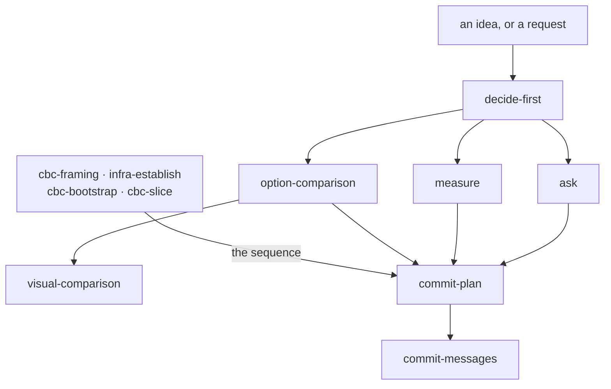
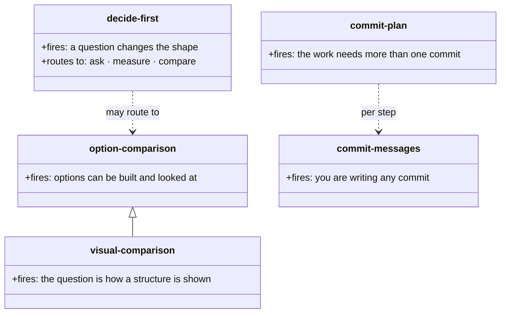
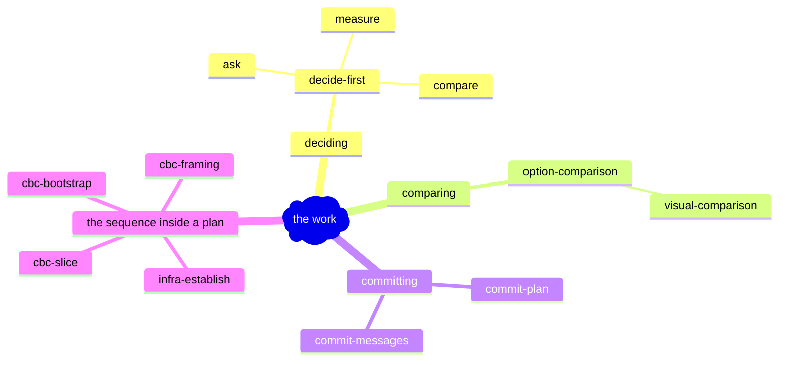
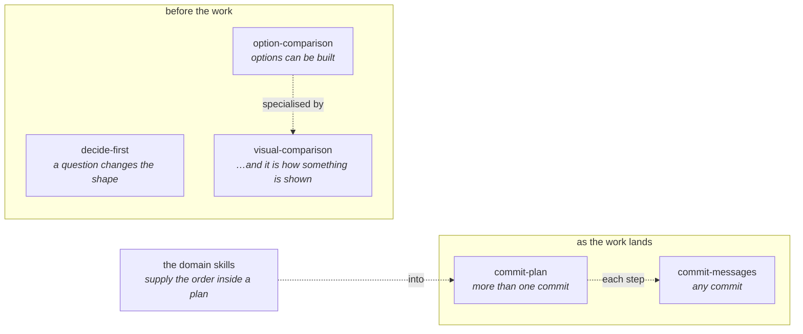

# What shape the chain section takes

Draft for `visual-comparison`. Requirements first, then every
candidate built — including the ones that are not pictures, per its
§1 rule.

## The defect this answers

Ten conventions, ten manuals, and nothing states how they relate. A
reader learns what `commit-plan` is from its manual and what
`decide-first` is from its own, and nowhere learns that one hands
to the other, that neither requires the other, or that the sequence
inside a plan comes from somewhere else entirely.

## What a reader must get

1. **The order things happen in**, from an idea to committed work.
2. **That each fires on its own.** Nothing here requires the one
   before it: a typo fix calls `commit-messages` with no plan and
   no deciding.
3. **Which specialises which** — `visual-comparison` is
   `option-comparison` for things you look at.
4. **Where the *sequence* inside a plan comes from**: the domain
   skills, which are not conventions.
5. **It must not restate a rule.** Every rule lives in a manual or
   a skill. A shape that tempts restatement fails.
6. **It must cost less to keep true than to read.** Ten
   conventions change; a shape needing an edit per change goes
   stale, and a stale map is worse than none.

---

## A. Mermaid flowchart

**Rendered and read.** It carries 1, 3 and 4. It **fails 2, and
fails it hard**: every arrow asserts that you pass through, so the
picture says a typo fix begins at `decide-first`. That is the
`sequenceDiagram` failure of ADR-0028 in new clothes — a notation
asserting the opposite of the rule the document exists to state.
Adding a bypass arrow from `idea` straight to `cm` makes it worse:
a picture with an arrow for every legal path is a picture of
nothing.

## B. Table

| Fires when | What it is | Hands to |
|---|---|---|
| something is undecided and the shape depends on it | `decide-first` | whichever of the three below settles it |
| the answer is in someone's head | *ask* | — |
| the answer is in the material | *measure* | — |
| options can be built and compared | `option-comparison` | — |
| …and what is being chosen is how something is shown | `visual-comparison` | — |
| the work needs more than one commit | `commit-plan` | `commit-messages`, per step |
| you are writing any commit | `commit-messages` | — |

**Built and read.** Carries 1 weakly — row order implies sequence
without asserting it, which turns out to be exactly right for 2:
a table makes no claim that you traverse it. Carries 3 by
indentation, 5 well (a cell has no room to restate a rule), and 6
best of the four — a new convention is a row. **Fails 4**: the
domain skills are not a "fires when", and forcing them into a row
misdescribes them.

## C. Numbered list

> 1. **`decide-first`** — when something is undecided and the shape
>    of the work depends on it. Routes to *ask*, *measure*, or a
>    comparison.
> 2. **`option-comparison`** — when options can be built and
>    looked at. **`visual-comparison`** is the same method when the
>    choice is how a structure is shown.
> 3. **`commit-plan`** — when the work needs more than one commit.
> 4. **`commit-messages`** — when you are writing any commit.
>
> The sequence *inside* a plan is not here: it comes from the
> domain skill that knows the work.
>
> Each fires on its own. A typo fix is 4 alone.

**Built and read.** Carries all six. Numbering implies order, the
closing line withdraws the implication, and 4 fits as a sentence
because it is an exception rather than an item. Weakest on 1 — a
list of four is not obviously a *flow* — and strongest on 5, since
there is nowhere to restate anything.

## D. Prose

> Work that has not settled its shape goes to `decide-first`, which
> names the open questions and routes each to an ask, a
> measurement, or `option-comparison` — `visual-comparison` where
> the question is how something is shown. Once settled, work
> needing more than one commit is sequenced by `commit-plan`, and
> every commit is written by `commit-messages`. The order *within*
> a plan comes from the domain skill that knows the work, which is
> why `commit-plan` stays generic. None of this is a pipeline: each
> fires at its own moment, and a typo fix reaches only the last.

**Built and read.** Carries all six, in 90 words, and 2 and 4 read
better here than anywhere — "none of this is a pipeline" is a
sentence, not a diagram element. Weakest on 1: a reader scanning
for *what fires when* has to read the whole paragraph rather than
find a line.

---

## Verdicts

| | A. picture | B. table | C. list | D. prose |
|---|---|---|---|---|
| 1. the order | **pass** | weak | weak | weak |
| 2. each stands alone | **fail** | pass | pass | **pass** |
| 3. what specialises what | pass | pass | pass | pass |
| 4. where sequence comes from | pass | **fail** | pass | **pass** |
| 5. no rule restated | weak | **pass** | **pass** | pass |
| 6. cheap to keep true | weak | **pass** | pass | pass |

## What building found

**The picture fails the one requirement the section exists for.**
Requirement 2 — each fires on its own — is what a reader most needs
and what arrows most strongly deny. A flowchart of this cannot say
"you may start anywhere", and the fix that suggests itself, an
arrow per legal path, destroys the picture. Second time this method
has rejected a diagram for asserting the opposite of the truth
(ADR-0028 was the first), and the first time it has rejected *all*
pictures rather than one dialect.

**The table fails on what it cannot hold rather than what it
shows.** The domain skills are not a trigger and have no "fires
when"; a row for them would be a lie in a column. That is a real
finding about tables, not about this table.

**C and D are close, and they fail differently on the same
requirement.** Both are weak on 1 — neither shows a flow — but a
list is scannable and prose is not, while prose says 2 and 4 in
words a list needs a footnote for.

**Recommendation: C, with D's closing sentence.** A numbered list
of four, then two sentences: where the sequence comes from, and
that none of it is a pipeline. That is C's scannability with the
two things prose said better, and it is the cheapest of the four to
keep true.

**No picture wins.** Recorded plainly, because
`visual-comparison`'s merge-back trigger (CBC ADR-0030 decision 10)
turns on exactly this: whether a comparison whose winner is not a
picture ever happens. It just did.

---

# Second round: if it is a picture, which dialect?

The user chose a picture. The verdict above stands as a reading —
A carried 1, 3 and 4 and failed 2 — so the question becomes whether
another dialect carries 2 without losing the rest. Same six
requirements. `visual-comparison` §4: the dialect built for the job
can be the one that fails, so these are built, not reasoned.

## E. `classDiagram`

**Built and read.** Requirement 3 is *drawn* rather than annotated
— the inheritance arrow is the claim, and it is the only dialect
here that states it natively. Each box carries its own trigger, so
2 survives: a class diagram asserts no traversal, and a reader does
not think they must construct `decide-first` before
`commit-messages`. Requirement 1 is **lost**: there is no order at
all, only relations. 4 has no home — the domain skills are neither
a class nor a parent. And it lies a little by dialect: these are
not types, and `..>` means *depends on*, which `decide-first` does
not.

## F. `mindmap`

**Built and read.** 2 is solved *structurally* — there are no
arrows, so no traversal can be asserted, and nothing tempts a
reader into a route. 4 fits, as a branch, which is the first
candidate where the domain skills sit naturally rather than being
forced. 3 is implied by nesting and is **wrong by implication**:
nesting reads as *contains*, and `visual-comparison` is not part of
`option-comparison`, it is a specialisation. 1 is gone entirely,
and 6 is the worst of any candidate — Mermaid's mindmap is
whitespace-sensitive and a reordering is a silent re-parse.

## G. `flowchart`, grouped by moment

**Built and read.** The two subgraphs carry 1 as *stages*, not as a
route — nothing crosses between them, so nobody reads a path from
`decide-first` to `commit-messages`. That is 1 and 2 held at once,
which no other candidate manages. Triggers are in the nodes, so a
reader sees what fires when. 3 is a labelled dotted arrow — stated,
not drawn, weaker than E. 4 has a box and an arrow into `cp`,
which reads correctly. 6 is middling: adding a convention is a
node and a subgraph line.

---

## Verdicts, both rounds

| | A. flow | E. class | F. mindmap | G. grouped |
|---|---|---|---|---|
| 1. the order | pass | **fail** | **fail** | pass (as stages) |
| 2. each stands alone | **fail** | pass | **pass** | pass |
| 3. what specialises what | pass | **pass** (drawn) | **fail** (implies contains) | pass (labelled) |
| 4. where sequence comes from | pass | **fail** | pass | pass |
| 5. no rule restated | weak | weak | pass | weak |
| 6. cheap to keep true | weak | weak | **fail** | ok |

## What the second round found

**Grouping by moment is what let a flowchart hold 1 and 2 at
once.** A chained flowchart cannot: its arrows are the order and
the order is the lie. Two subgraphs with nothing crossing between
them say *these happen around here* without saying *you go this
way*. The fix was not a different dialect but a different use of
the same one — which is the opposite of what the first round's
finding suggested.

**The dialect that draws requirement 3 natively loses two others.**
`classDiagram`'s inheritance arrow is the best statement of
specialisation available, and it comes with no order, no home for
the domain skills, and a `..>` that means something we do not mean.
Third instance for §4's first entry.

**`mindmap` solves 2 by having no arrows and breaks 3 by having
nesting.** A shape with no way to be wrong about direction is also
a shape with no way to be right about relation. Worth keeping: its
whitespace sensitivity makes it the most expensive to edit, which
requirement 6 catches and no reading would have.

**Recommendation: G**, with the one sentence under it. It is the
only candidate carrying 1 and 2 together, and the sentence covers
what its dotted arrows only imply.
